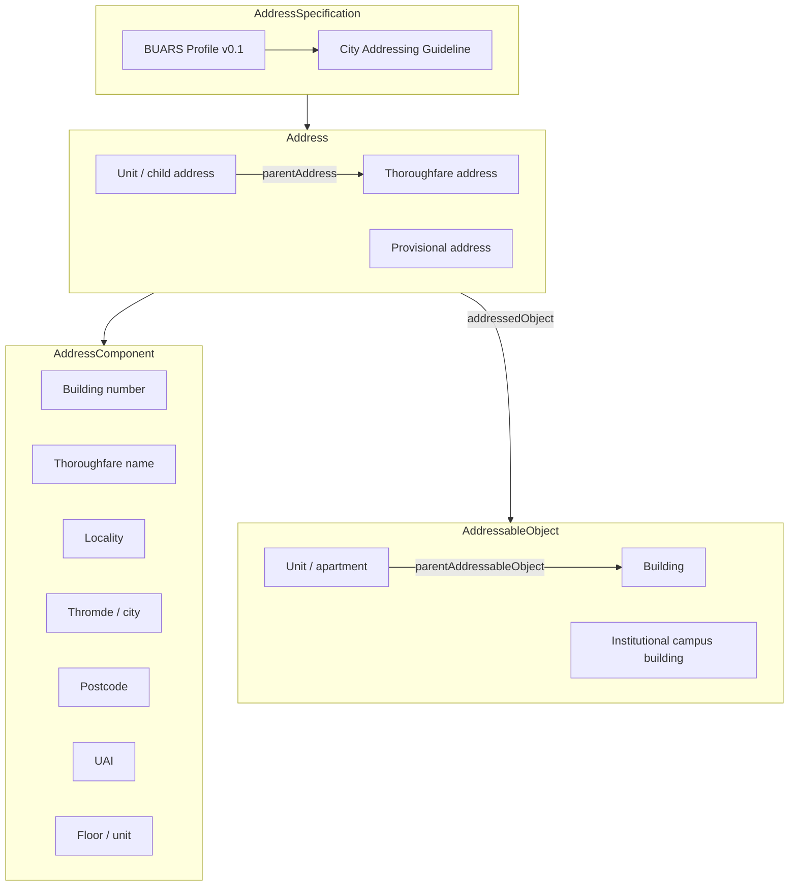
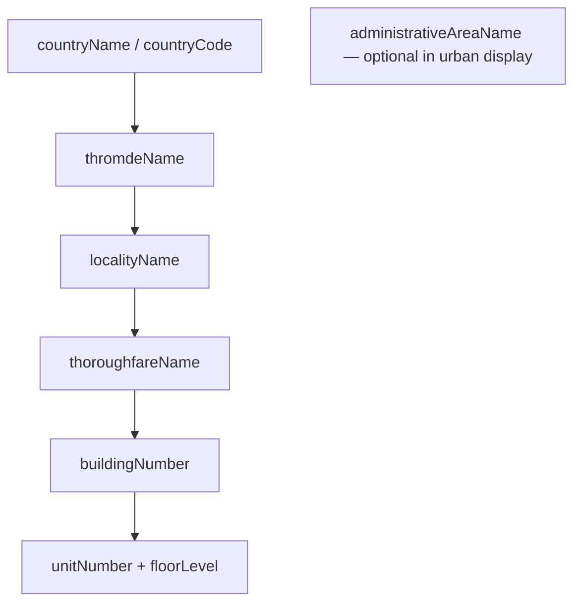
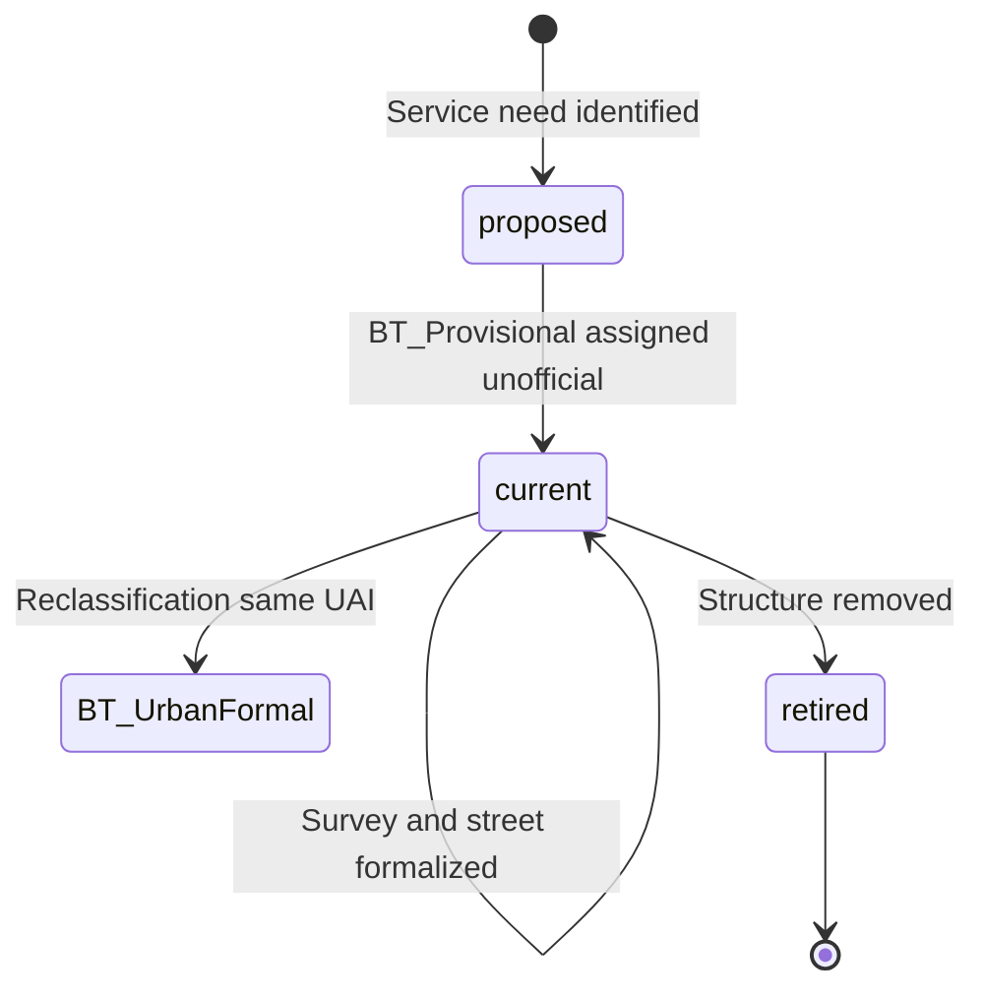

# Bhutan Urban Address Reference System — Proposal

**Document type:** ISO 19160-1 address profile (suggestive)  
**Status:** Draft for review — not yet adopted  
**Version:** 0.1 (June 2026)

---

## Profile identification

| Field | Value |
|-------|-------|
| **Profile name** | Bhutan Urban Address Reference System (BUARS) |
| **Developer** | Department of Human Settlement (DHS), Ministry of Infrastructure and Transport (MoIT), Royal Government of Bhutan |
| **Contact** | DHS — national addressing programme (to be designated) |
| **Parent specification** | *City Addressing Guideline for Bhutan* (urban implementation manual) |
| **Base standard** | ISO 19160-1:2015 — *Addressing — Part 1: Conceptual model* |
| **Related standards** | ISO 19160-2:2023 (assignment & governance); ISO 19160-3 (data quality); ISO 19160-4 / UPU S42 (postal); ISO 19152 LADM (cadastre crosswalk); BSB33:2017 (signage) |

### Purpose

This document defines the **address reference system** for urban Bhutan: the set of address classes, components, combination rules, object relationships, position representation, lifecycle attributes, and identifiers that turn the operational City Addressing Guideline into an interoperable, ISO-aligned conceptual model.

It is intended to be inserted as **Section 3 — Address Reference System** (or a standalone annex) in the national addressing framework, satisfying ISO 19160-2 Req 3 and Rec 2.

### Conformance classes claimed

| ISO 19160-1 conformance class | BUARS claim | Notes |
|-------------------------------|-------------|-------|
| **Core** | Required | Address, AddressComponent, AddressableObject, AddressAlias, AddressSpecification |
| **Lifecycle** | Required | Mandatory for all production addresses from pilot onward |
| **Locale** | Required | Dzongkha + English as separate locale records |
| **Provenance** | Recommended at pilot; mandatory at national rollout | Authority = assigning Thromde |
| **Full** | Target by national ADMS go-live | All four classes |

---

## 1. Background and authority

### 1.1 Why addresses are assigned

Bhutan assigns urban addresses to:

- identify buildings and units for navigation, postal delivery, and emergency response;
- link properties to municipal GIS, NLCS cadastral parcels, and national spatial data infrastructure;
- provide device-independent location (visible signage + logical numbering);
- support tourism, utilities, and urban planning.

These objectives align with the six objectives in the City Addressing Guideline, Section 2.

### 1.2 Assigning authority

| Level | Authority | Scope |
|-------|-----------|-------|
| **National** | DHS / MoIT | Policy, UAI registry rules, ADMS architecture, quality standards |
| **Municipal (Thromde)** | Thromde engineering / planning office | Street naming, building numbering, signage approval, municipal address register |
| **National cadastre** | NLCS | Parcel ID crosswalk to UAI; verification of land–address linkage |
| **Postal** | Bhutan Post | Postcode assignment; UPU S42 template co-development |
| **Terminology** | DDC | Authoritative Dzongkha street names; transliteration to English |

Only addresses with `status = official` and `lifecycleStage = current` issued by a Thromde (or DHS on its behalf) are authoritative for legal and service-delivery purposes. Provisional addresses (Section 8.6 of the City Guideline) remain `unofficial` until formalized.

### 1.3 Geographic context

BUARS applies primarily to **Thromde (urban) areas** with navigable thoroughfare networks — Thimphu, Phuentsholing, Paro, and other designated municipalities. A separate **rural address profile** (area typology) is planned for gewog/chiwog-based addressing; this document defines urban classes only, with a transitional class for rural–urban fringe (City Guideline Section 8.5).

---

## 2. Conceptual model overview

ISO 19160-1 defines an address as **structured information that unambiguously determines an object** for identification and location. BUARS implements the core model as follows.



**Key design choices for Bhutan**

1. **UAI** (`addressedObjectIdentifier`) is the permanent digital key — independent of street renames or renumbering.
2. **Thoroughfare typology** dominates urban addresses (street + distance-based number + locality).
3. **Parent/child** models multi-unit buildings and institutional campuses (City Guideline Sections 7–8).
4. **Locale alternatives** model Dzongkha and English as separate `AddressComponentValue` records, not a single concatenated string.
5. **Address aliases** model corner buildings and multi-entrance cases (City Guideline Section 8.1–8.2).

---

## 3. Optional classes — profile constraints

Per ISO 19160-1 Section 7.5.2(e), BUARS states the status of optional model classes:

| ISO 19160-1 class | Status in BUARS | Constraint |
|-------------------|-----------------|------------|
| **Address** | Mandatory | — |
| **AddressComponent** | Mandatory | Extended with Bhutan-specific derived types (see Section 5) |
| **AddressableObject** | **Mandatory** | Required for ADMS and NLCS integration |
| **AddressSpecification** | **Mandatory** | Points to this profile + City Guideline |
| **ReferenceObject** | **Mandatory** | Thoroughfare centreline, parcel polygon, admin boundary |
| **AddressAlias** | **Mandatory** | Corner and multi-entrance buildings |
| **AddressedPeriod** | Optional | Use when an address number is reassigned to a new building on the same plot |

---

## 4. Address classes

### 4.1 Address class codelist (Bhutan extension)

| Code | Typology | Description | City Guideline basis |
|------|----------|-------------|----------------------|
| `BT_UrbanFormal` | thoroughfare | Standard street-front building address in a Thromde | Sections 5–6, 9 |
| `BT_UrbanUnit` | thoroughfare | Unit/apartment/office within a parent building | Section 7; Annex I (to be completed) |
| `BT_Institutional` | thoroughfare | Campus or large parcel; main entrance + internal suffixes | Section 8.3 |
| `BT_Provisional` | thoroughfare | Temporary/informal settlement; service delivery only | Section 8.6 |
| `BT_RuralTransition` | area | Fringe development extending urban numbering along access roads | Section 8.5 |
| `BT_AliasSecondary` | thoroughfare | Secondary alias of an existing formal address (corner / alternate entrance) | Sections 8.1–8.2 |

### 4.2 Address class specifications

#### Class `BT_UrbanFormal`

| Attribute | Value |
|-----------|-------|
| **Typology** | thoroughfare |
| **Typical object** | Single building or primary building on a plot |
| **Uniqueness scope** | Building number unique within thoroughfare + locality |
| **Numbering rule** | 10 m distance-based hybrid; odd/even by side (City Guideline Section 6) |
| **Minimum components** | buildingNumber, thoroughfareName, localityName, thromdeName, countryCode, uai |
| **Optional components** | buildingName, postcode, floorLevel, unitNumber, landmark |
| **Position** | Primary: `streetFront` at main entrance; Secondary: `accessPoint` if set back (Section 8.4) |
| **Status** | official when lifecycleStage = current |

**Rendered example (English locale)**

> 124 Chang Lam, Changjiji, Thimphu, Bhutan  
> UAI: BT-TH-CH-0124-0001

#### Class `BT_UrbanUnit`

| Attribute | Value |
|-----------|-------|
| **Typology** | thoroughfare |
| **Typical object** | Apartment, office, or shop within a building |
| **Parent** | One `BT_UrbanFormal` parent address and parent building object |
| **Inheritance** | Inherits thoroughfare, locality, thromde, country, UAI root from parent |
| **Additional components** | floorLevel, unitNumber (mandatory) |
| **Uniqueness scope** | Unit unique within parent building |
| **Position** | `streetFront` at unit entrance, or inherited from parent if internal |

**Rendered example**

> Level 1 — Unit 05, 87 Phenday Lam, Kabraytar, Phuentsholing, Bhutan  
> UAI: BT-PH-PD-0087-0001-U05

#### Class `BT_Institutional`

| Attribute | Value |
|-----------|-------|
| **Typology** | thoroughfare |
| **Typical object** | Hospital, school, monastery, government campus |
| **Rule** | Official address from main administrative entrance; internal structures use alphabetical/chronological suffix | Section 8.3 |
| **Parent/child** | Campus = parent object; internal buildings = child objects with suffix addressing |
| **Position** | `streetFront` at main gate; internal buildings may use `centroid` |

#### Class `BT_Provisional`

| Attribute | Value |
|-----------|-------|
| **Typology** | thoroughfare |
| **Typical object** | Temporary structure in emerging settlement |
| **Status** | **unofficial** — does not confer legal recognition (City Guideline disclaimer) |
| **Lifecycle** | proposed → current (provisional) → retired or promoted to `BT_UrbanFormal` |
| **Components** | Minimal: buildingNumber (sequential), localityName, thromdeName, countryCode, uai |
| **Promotion** | When road network and permanent structure exist, reclassify to `BT_UrbanFormal` without changing UAI |

#### Class `BT_RuralTransition`

| Attribute | Value |
|-----------|-------|
| **Typology** | area / thoroughfare hybrid |
| **Typical object** | New development at urban fringe |
| **Rule** | Extend street naming and distance numbering gradually (Section 8.5) |
| **Note** | Full rural profile to be defined separately; this class bridges to it |

#### Class `BT_AliasSecondary`

| Attribute | Value |
|-----------|-------|
| **Typology** | thoroughfare |
| **Typical object** | Same building as primary address, different street frontage |
| **Alias type** | `classAlias` or `localeAlias` per ISO AddressAliasType |
| **Rule** | One alias has `preferenceLevel = 1` (primary for postal/emergency); others reserved (Section 8.1) |
| **Same UAI** | All aliases share one UAI and one AddressableObject |

---

## 5. Address components

### 5.1 Component type codelist (Bhutan profile)

BUARS uses ISO 19160-1 `AddressComponentType` values plus Bhutan extensions:

| Component type | ISO / BT | Value type (`Any`) | Scope / notes |
|----------------|----------|-------------------|---------------|
| `addressedObjectIdentifier` | ISO | CharacterString (pattern) | **UAI** — see Section 6 |
| `administrativeAreaName` | ISO | CharacterString | Dzongkhag name where needed for national context |
| `countryCode` | ISO | CharacterString | `BT` (ISO 3166-1 alpha-2) |
| `countryName` | ISO | CharacterString | `Bhutan` / `འབྲུག` |
| `localityName` | ISO | CharacterString | Neighborhood (e.g. Changjiji, Kabraytar) — unique within Thromde |
| `postcode` | ISO | CharacterString | Assigned by Bhutan Post; mandatory at national rollout |
| `thoroughfareName` | ISO | CharacterString | Includes suffix: Lam, Rd, Hwy per road class (Section 5) |
| **`buildingNumber`** | **BT ext.** | CharacterString | Distance-based integer; may include alpha suffix (e.g. 25A) |
| **`buildingName`** | **BT ext.** | CharacterString | Optional commercial/building name |
| **`floorLevel`** | **BT ext.** | CharacterString | e.g. `Level 1`, `Basement`, `Fourth Floor` |
| **`unitNumber`** | **BT ext.** | CharacterString | e.g. `05`, `4`, `Unit 12` |
| **`thromdeName`** | **BT ext.** | CharacterString | City/municipality (Thimphu, Phuentsholing, Paro) |
| **`landmark`** | **BT ext.** | CharacterString | Optional wayfinding aid |

**Thoroughfare name structure**

`[Name] + [Suffix]` where suffix is determined by road classification (City Guideline Section 5):

| Road class | Suffix | Example |
|------------|--------|---------|
| National highway (AH, PNH, SNH) | Hwy | AH48 Hwy |
| Dzongkhag road | Rd | Dopshari Rd |
| Thromde street | **Lam** | Chang Lam |
| Farm/access | Rd | (as applicable) |

### 5.2 Component scope hierarchy

Uniqueness is enforced through `scopeComponent` relationships:



| Component | Scoped by | Uniqueness rule |
|-----------|-----------|-----------------|
| thoroughfareName | localityName (within thromde) | Unique within locality; may repeat across localities |
| buildingNumber | thoroughfareName | Unique per street segment |
| unitNumber | buildingNumber + floorLevel | Unique within building |
| uai | national registry | Globally unique within Bhutan |

### 5.3 Mandatory / optional matrix by address class

| Component | BT_UrbanFormal | BT_UrbanUnit | BT_Institutional | BT_Provisional | BT_AliasSecondary |
|-----------|:--------------:|:------------:|:----------------:|:--------------:|:-----------------:|
| uai | M | M | M | M | M (shared) |
| buildingNumber | M | M (inherited) | M | M | M (shared) |
| thoroughfareName | M | M (inherited) | M | O | M (may differ) |
| localityName | M | M (inherited) | M | M | M (shared) |
| thromdeName | M | M (inherited) | M | M | M (shared) |
| countryCode / countryName | M | M | M | M | M |
| floorLevel | O | M | O | — | O |
| unitNumber | O | M | O | — | O |
| buildingName | O | O | O | — | O |
| postcode | O → **M*** | O → **M*** | O → **M*** | O | O → **M*** |
| landmark | O | O | O | O | O |
| administrativeAreaName | O | O | O | O | O |

*M = mandatory, O = optional, — = not used*

\* Postcode transitions from optional to mandatory when Bhutan Post national postcode scheme is activated (currently marked future in City Guideline Section 9).

### 5.4 Locale handling (Locale conformance)

Each `AddressComponentValue` with a display role shall carry `locale`:

| Locale ID | Language | Script | Usage |
|-----------|----------|--------|-------|
| `dz_BT` | Dzongkha | Tibetan (Joyig/Lhoyig/Drukyig) | Authoritative for pronunciation and signage |
| `en_BT` | English | Latin | Transliteration per DDC rules; navigation and international mail |

Locale alternatives use `AddressComponentValueType = localeAlternative`. Spelling corrections are **not** alternatives — they are provenance-tracked updates.

**Example — thoroughfareName values for one component**

| value | type | locale |
|-------|------|--------|
| Chang Lam | defaultValue | en_BT |
| ཆང་ལམ | localeAlternative | dz_BT |

---

## 6. Unique Address Identifier (UAI)

The City Guideline Section 10 marks UAI as **[FUTURE]**. BUARS recommends **mandatory UAI from pilot implementation** — required for ISO 19160-2 Rec 7, NLCS crosswalk, and ADMS interoperability.

### 6.1 UAI purpose

- Permanent identifier for the address record and addressable object
- Stable across street renames, renumbering, and alias changes
- Golden key linking Thromde ADMS, NLCS parcel, Bhutan Post, and emergency dispatch

UAI is **not** a substitute for the human-readable address; it is the machine identifier.

### 6.2 UAI structure (proposed)

```
BT-{TH}-{LOC}-{BLD}-{SEQ}[-{UNIT}]
```

| Segment | Meaning | Example |
|---------|---------|---------|
| `BT` | ISO 3166-1 alpha-2 country code | BT |
| `{TH}` | Thromde code (2 letters, national register) | TH = Thimphu, PH = Phuentsholing, PR = Paro |
| `{LOC}` | Locality code (2–4 alphanumeric, Thromde-assigned) | CH = Changjiji, PD = Phenday area |
| `{BLD}` | Zero-padded building number (4 digits) | 0124, 0087 |
| `{SEQ}` | Sequence for disambiguation (suffix plots, reissues) | 0001 |
| `{UNIT}` | Optional unit suffix | U05, FL4 |

**Examples**

| UAI | Description |
|-----|-------------|
| `BT-TH-CH-0124-0001` | Building 124 Chang Lam, Changjiji, Thimphu |
| `BT-PH-PD-0087-0001-U05` | Unit 05, building 87 Phenday Lam, Phuentsholing |
| `BT-PR-DS-0051-0001` | Building 51 Shari Lam, Dop Shari, Paro (matches City Guideline Section 9.2 example pattern) |

### 6.3 UAI ↔ external identifiers

| External system | Identifier | Relationship |
|-----------------|------------|--------------|
| NLCS cadastre | Parcel / plot ID | 1 UAI : 1 primary parcel (1:n for multi-parcel campuses with note) |
| Thromde ADMS | Internal record ID | 1:1 |
| Bhutan Post | Postcode + delivery point | n:1 (many units, one postcode area) |
| GIS | Feature GUID | 1:1 with address point feature |

---

## 7. Addressable objects

### 7.1 Object type codelist (Bhutan)

| Code | Description | Typical address class |
|------|-------------|----------------------|
| `building` | Single building or primary structure on plot | BT_UrbanFormal |
| `unit` | Apartment, office, shop within building | BT_UrbanUnit |
| `institutionalBuilding` | Structure within campus | BT_Institutional (child) |
| `institutionalCampus` | Hospital, school, monastery complex | BT_Institutional (parent) |
| `temporaryStructure` | Non-permanent building | BT_Provisional |
| `landParcel` | Cadastral parcel (NLCS) | Reference object; linked via UAI |

### 7.2 Parent / child relationships

| Parent object | Child object | Address relationship |
|---------------|--------------|----------------------|
| Building | Unit | Parent address → child address; child inherits street/locality |
| Institutional campus | Internal building | Main address + suffix (Section 8.3) |
| Building | Reserved alias entrance | Same object; multiple alias addresses |

### 7.3 Position representation

BUARS uses `AddressPosition` with geometry in **EPSG:5266** (Bhutan National Grid) or **EPSG:4326** (WGS 84 lat/long) for exchange:

| Position type | Use in Bhutan |
|---------------|---------------|
| `streetFront` | Main entrance facing assigned thoroughfare — **default for formal addresses** |
| `accessPoint` | Driveway meets street (setback buildings, Section 8.4) |
| `centroid` | Building footprint centroid — GIS display only; not for navigation default |
| `approximated` | Provisional addresses before survey |

**Rule:** The ADMS shall store at least one `streetFront` or `accessPoint` position for every `BT_UrbanFormal` address with `lifecycleStage = current`.

---

## 8. Address aliases

When one building is reachable from multiple streets (City Guideline Section 8.1–8.2):

| Field | Primary alias | Secondary alias |
|-------|---------------|-----------------|
| preferenceLevel | 1 | 2 |
| AddressAliasType | `classAlias` | `classAlias` |
| status | official | official (reserved) |
| thoroughfareName | Primary access street | Alternate street |
| uai | Shared | Shared |
| addressedObject | Same building | Same building |

Secondary aliases may be `lifecycleStage = reserved` until an entrance is activated.

---

## 9. Lifecycle

### 9.1 Address lifecycle stages

| Stage | Bhutan use |
|-------|------------|
| `proposed` | Submitted by developer / owner; pending Thromde approval |
| `current` | Approved, signage ordered/installed, in ADMS |
| `reserved` | Number or alias held for future access (Section 6.4 multi-access plots) |
| `rejected` | Application denied — record retained for audit |
| `retired` | Demolished, merged, or reclassified; UAI never reused |
| `unknown` | Legacy data migration only |

### 9.2 Addressable object lifecycle stages

| Stage | Bhutan use |
|-------|------------|
| `proposed` | Building permit submitted |
| `approved` | Permit approved; address number allocated |
| `underConstruction` | Address assigned; signage pending |
| `exists` | Occupied or complete; full services |
| `ceasedToExist` | Demolished — address retired |
| `unknown` | Legacy migration |

### 9.3 Lifespan and versioning

- `lifespan.validFrom` = date of Thromde approval
- `lifespan.validTo` = null while current; set on retirement
- `lifespan.version` increments on any component or position change (ISO Lifecycle Req 3)

### 9.4 Provisional → formal promotion workflow



---

## 10. Reference objects

Address components shall reference spatial objects where available:

| Component | ReferenceObject type | Source |
|-----------|---------------------|--------|
| thoroughfareName | street centreline (polyline) | Thromde road network GIS |
| localityName | locality boundary (polygon) | Thromde admin boundaries |
| thromdeName | municipal boundary | MoIT / Thromde |
| buildingNumber | access point (point) | ADMS survey |
| uai | land parcel (polygon) | NLCS cadastre |

---

## 11. Address specification citation

The `AddressSpecification` for all BUARS addresses shall cite:

1. This profile document (BUARS v0.1)
2. *City Addressing Guideline for Bhutan* (operational rules)
3. Applicable Thromde council resolution approving the address (provenance)

---

## 12. Instance examples

### 12.1 Formal urban building (single occupancy)

**Class:** `BT_UrbanFormal` · **Locale:** en_BT

| Component | Value |
|-----------|-------|
| uai | BT-TH-CH-0124-0001 |
| buildingNumber | 124 |
| thoroughfareName | Chang Lam |
| localityName | Changjiji |
| thromdeName | Thimphu |
| countryCode | BT |
| countryName | Bhutan |
| postcode | *(pending)* |

**Dzongkha display:** ཆང་ལམ 124, ཆང་སྤྱི་སྤྱི, ཐིམ་ཕུ, འབྲུག

**Position:** streetFront — 27.4712°N, 89.6415°E (WGS 84)

---

### 12.2 Multi-unit building (child address)

**Class:** `BT_UrbanUnit` · **Parent:** BT-PH-PD-0087-0001

| Component | Value |
|-----------|-------|
| uai | BT-PH-PD-0087-0001-U05 |
| floorLevel | Level 1 |
| unitNumber | 05 |
| buildingNumber | 87 *(inherited)* |
| thoroughfareName | Phenday Lam *(inherited)* |
| localityName | Kabraytar *(inherited)* |
| thromdeName | Phuentsholing |
| countryName | Bhutan |

---

### 12.3 Corner building with alias

**Primary (preferenceLevel 1)**

> 45 Norzin Lam, Norzin, Thimphu — UAI: BT-TH-NZ-0045-0001

**Secondary alias (preferenceLevel 2, reserved)**

> 45 Gongphel Lam, Norzin, Thimphu — same UAI, same building object

---

### 12.4 Provisional address

**Class:** `BT_Provisional` · **status:** unofficial

| Component | Value |
|-----------|-------|
| uai | BT-TH-EM-0023-0001 |
| buildingNumber | P-23 (provisional prefix) |
| localityName | Emerging block name |
| thromdeName | Thimphu |
| lifecycleStage | current |
| disclaimer | No legal recognition per Section 8.6 |

---

## 13. Data model mapping (ADMS minimum record)

Each address in the national ADMS shall store at minimum:

| ADMS field | ISO 19160-1 mapping |
|------------|---------------------|
| uai | Address.id + addressedObjectIdentifier component |
| address_class | Address.class |
| status | Address.status |
| lifecycle_stage | Address.lifecycleStage |
| valid_from / valid_to | Address.lifespan |
| assigning_authority | Address.provenance |
| parent_uai | Address.parentAddress.id |
| preference_level | Address.preferenceLevel (aliases) |
| *component values × n* | AddressComponent[] with locale |
| geom | Address.position |
| parcel_id | ReferenceObject → NLCS |
| thromde_code | scope for municipal filter |

---

## 14. Relationship to City Addressing Guideline

| City Guideline section | BUARS section | Action on guideline |
|------------------------|---------------|---------------------|
| Section 9 — Address format | Sections 4–5, 12 | Fix mandatory matrix (floor/unit only for units) |
| Section 10 — UAI [FUTURE] | Section 6 | **Activate UAI** — remove [FUTURE] |
| Section 7 — Unit numbering | Section 4.2, 7 | **Complete Annex I** with child address rules |
| Section 8 — Special cases | Sections 4, 8 | Formalize as address classes and aliases |
| Section 14 — GIS / database | Section 13 | Align field names to ISO model |
| Section 13 — Institutional roles | Section 1.2 | Add lifecycle workflow ownership (19160-2) |

---

## 15. Implementation roadmap

| Phase | Deliverable | Timeline (suggestive) |
|-------|-------------|----------------------|
| **1 — Profile adoption** | DHS/MoIT endorse BUARS v1.0; insert into national framework | 0–3 months |
| **2 — Pilot** | Thimphu + Phuentsholing: UAI registry, ADMS with lifecycle, 500+ addresses | 3–18 months |
| **3 — NLCS crosswalk** | UAI ↔ parcel ID for pilot areas | parallel with Phase 2 |
| **4 — Postcode** | Bhutan Post S42 template + postcode mandatory flag | before national rollout |
| **5 — National ADMS** | API, ISO 19160-3 quality reports, open data licence | 18–36 months |
| **6 — Rural profile** | Separate `BT_RuralArea` class family for gewog/chiwog | after urban stabilization |

---

## 16. Conformance self-check (ISO 19160-1 Section 7.5.2)

| Requirement | BUARS status |
|-------------|--------------|
| a) Developer name and contact | Section — Profile identification |
| b) Specification citation | City Guideline + this profile |
| c) Conformance classes | Core + Lifecycle + Locale (+ Provenance target) |
| d) Background and authority | Section 1 |
| e) Optional class constraints | Section 3 |
| f) Profile model diagram | Section 2 |
| g) Component matrix per class | Section 5.3 |
| h) Value types per component | Section 5.1 |
| i) Position representation | Section 7.3 |
| j) Instance examples | Section 12 |
| Locale statement | Section 5.4 |
| Profile-specific codelist definitions | Sections 4.1, 5.1, 7.1 |

---

## References

- ISO 19160-1:2015 — Addressing — Part 1: Conceptual model
- ISO 19160-2:2023 — Assigning and maintaining addresses
- ISO 19152:2012 — Land Administration Domain Model (LADM)
- *City Addressing Guideline for Bhutan* (DHS / MoIT)
- BSB33:2017 — Road Safety Signs and Symbols
- UPU S42 — International postal address template (profiled as ISO 19160-4)
- *Bhutan Addressing Guideline ISO 19160-2 Gap Analysis* (internal)

---

## Document control

| Version | Date | Author | Changes |
|---------|------|--------|---------|
| 0.1 | 2026-06 | Addressing programme (suggestive draft) | Initial BUARS profile from ISO 19160-1 + City Guideline |

**Distribution:** DHS, MoIT, Thromdes, NLCS, Bhutan Post, DDC, BSB — for consultation.
