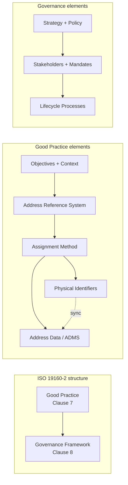
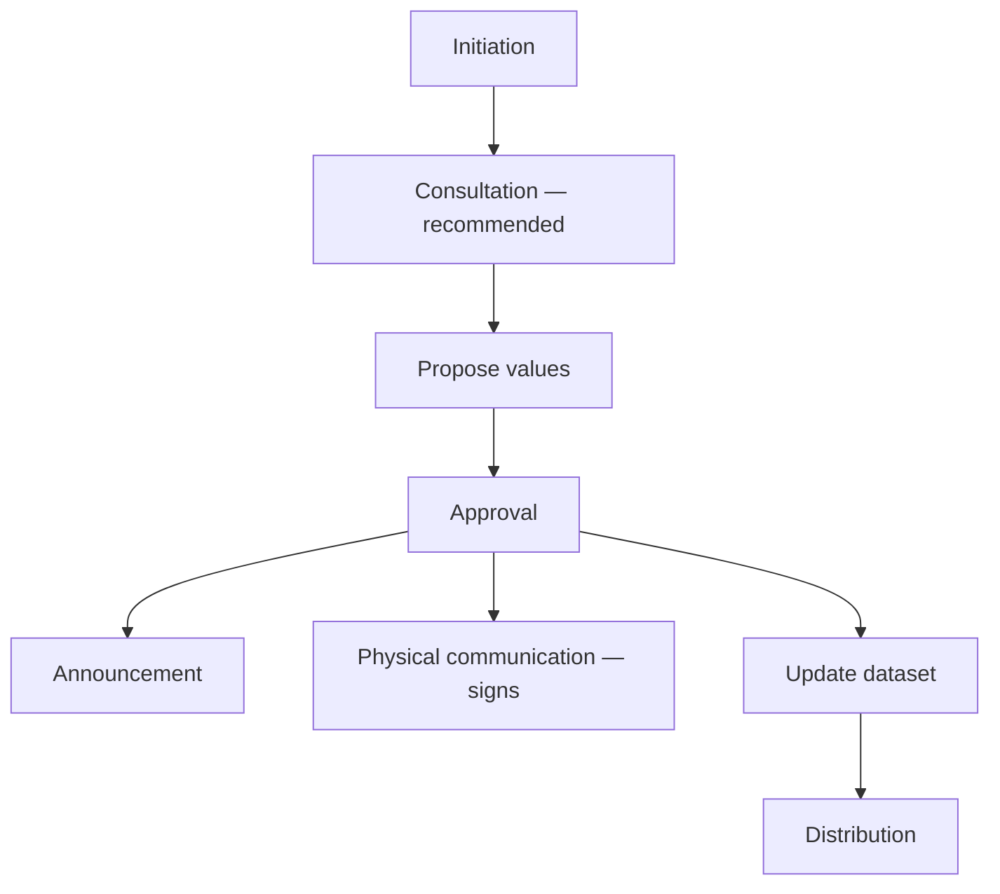
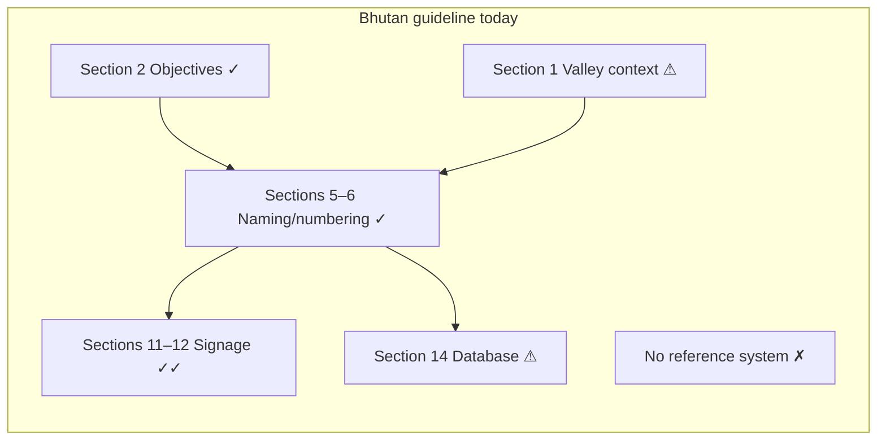

# Gap Analysis: Bhutan City Addressing Guideline vs ISO 19160-2:2023

This report compares the **City Addressing Guideline Proposal for Bhutan** against **ISO 19160-2:2023** (*Assigning and maintaining addresses for objects in the physical world*). ISO 19160-2 defines **32 requirements** and **14 recommendations** across two conformance classes: **Good Practice** (how addresses are assigned) and **Governance** (who manages them and through what processes).

**Documents reviewed**

| Document | Role |
|----------|------|
| `CITY ADDRESSING GUIDELINE PROPOSAL FOR BHUTAN.md` | Subject of assessment |
| ISO 19160-2:2023 | Benchmark standard |
| ISO 19160-1, -3, -4 | Related standards (referenced by ISO 19160-2) |

---

## Abbreviations

### Standards and technical terms

| Abbreviation | Full term | Meaning |
|--------------|-----------|---------|
| **ADMS** | Address Data Management System | Authoritative digital system for creating, maintaining, and sharing address records (database + GIS + workflows) |
| **ADS** | Advance Direction Sign | Road sign placed before a junction showing approaching routes (Bhutan Section 11) |
| **API** | Application Programming Interface | Machine-readable service for querying or updating address data |
| **CC BY** | Creative Commons Attribution | Open-data licence (e.g. New Zealand address dataset) |
| **DS** | Direction Sign / Intersection Direction Sign | Sign at an intersection guiding final turns (Bhutan Section 11) |
| **EMS** | Emergency Medical Services | Ambulance and related emergency response agencies |
| **GIS** | Geographic Information System | Spatial platform linking addresses to maps, roads, buildings, and boundaries |
| **GML** | Geography Markup Language | XML-based format for exchanging geospatial data |
| **GPS** | Global Positioning System | Satellite-based location service |
| **INSPIRE** | Infrastructure for Spatial Information in Europe | EU framework for harmonized spatial data, including addresses |
| **IP** | Intellectual Property | Legal ownership of addressing methods, data, and standards |
| **ISO** | International Organization for Standardization | Publisher of the 19160 addressing series and other standards |
| **JSON** | JavaScript Object Notation | Common data-exchange format for web APIs |
| **KPI** | Key Performance Indicator | Measurable target for addressing programme success |
| **RACI** | Responsible, Accountable, Consulted, Informed | Matrix assigning roles to governance tasks |
| **REST** | Representational State Transfer | Style of web API commonly used for address services |
| **SDMS** | Spatial Database Management System | Database engine with geometry/topology support |
| **SLA** | Service Level Agreement | Defined performance standard (e.g. update within 7 days) |
| **SOP** | Standard Operating Procedure | Documented step-by-step process |
| **URI** | Uniform Resource Identifier | Unique identifier for ISO requirements (e.g. `/req/goodPractice/...`) |
| **UPU** | Universal Postal Union | UN specialized agency; postal addressing standards (S42) |
| **UPU S42** | UPU Standard S42 | Postal address template standard; profiled as ISO 19160-4 |
| **UTM** | Universal Transverse Mercator | Map projection used in grid-based addressing (e.g. Saudi Arabia) |
| **UAI** | Unique Address Identifier | Permanent national/property ID independent of street name changes (Bhutan Section 10) |

### ISO 19160 series

| Abbreviation | Full term | Meaning |
|--------------|-----------|---------|
| **ISO 19160-1** | Addressing — Part 1: Conceptual model | Core address classes, components, and relationships |
| **ISO 19160-2** | Addressing — Part 2: Assigning and maintaining addresses | Good practice and governance (subject of this analysis) |
| **ISO 19160-3** | Addressing — Part 3: Address data quality | Quality elements and measures for address datasets |
| **ISO 19160-4** | Addressing — Part 4: International postal address components | Postal address template (= UPU S42 profile) |
| **ISO 19105** | Geographic information — Conformance and testing | Framework for ISO conformance classes and URIs |
| **Req** | Requirement | Mandatory provision if good practice / governance is claimed |
| **Rec** | Recommendation | Advisable provision; not mandatory for conformance |

### Bhutan agencies and local terms

| Abbreviation | Full term | Meaning |
|--------------|-----------|---------|
| **BSB** | Bhutan Standards Bureau | National standards body (e.g. BSB33 road signage) |
| **BSB33** | BSB Standard 33:2017 | Bhutan road safety signs and symbols standard |
| **DDC** | Dzongkha Development Commission | Authority for Dzongkha terminology and transliteration |
| **DHS** | Department of Human Settlement | National policy and technical lead for addressing (Bhutan Section 13) |
| **DDM** | Department of Disaster Management | Disaster preparedness and spatial data stakeholder |
| **MoIT** | Ministry of Infrastructure and Transport | National addressing guideline policy partner |
| **NLCS** | National Land Commission Secretariat | Cadastral data, land registry, parcel verification |
| **RBP** | Royal Bhutan Police | Law enforcement; address data for crime analysis |
| **Thromde** | Municipal / city corporation | Urban local government implementing addressing |
| **Dzongkhag** | District | Administrative division above gewog |
| **Gewog** | Block / sub-district | Rural administrative unit |
| **Chiwog** | Hamlet / village block | Sub-unit within gewog |
| **Lam** | Road / street (Dzongkha) | Urban street suffix used in Bhutan (e.g. Chang Lam) |
| **IRC** | Indian Roads Congress | Referenced for road signage typography dimensions |

### International examples cited in ISO 19160-2

| Abbreviation | Full term | Meaning |
|--------------|-----------|---------|
| **AS/NZS 4819** | Australian/New Zealand Standard 4819 | Distance-based rural/urban addressing standard |
| **BAN** | Base Adresse Nationale | France national address database |
| **KAIS** | Korean Address Information System | Republic of Korea authoritative address platform |
| **LINZ** | Land Information New Zealand | NZ custodian of official address dataset |
| **NAD** | National Address Database | South Africa central address registry |
| **NZ** | New Zealand | Country example with ISO 19160-1 profile |
| **SA / SAPO** | South Africa / South African Post Office | Rural addressing and NAD examples |
| **SANS 1883** | South African National Standard 1883 | SA addressing and data-exchange standards |

---

## 1. Executive Summary

### 1.1 Overall finding

The Bhutan proposal is a strong **urban operational manual** — especially street naming, 10 m distance-based numbering, bilingual BSB33 signage, and special-case rules. Relative to ISO 19160-2, it reads as an **implementation design guide** rather than a complete **addressing infrastructure standard**. It does **not** currently conform to either ISO conformance class.

| Dimension | Bhutan Guideline | ISO 19160-2 Expectation | Assessment |
|-----------|------------------|-------------------------|------------|
| Objectives & context | Service-delivery focused | Required; must guide all rules | Partial |
| Address reference system | Implicit (street + number + locality) | Required formal conceptual model | **Weak** |
| Assignment methodology | Detailed (odd/even, 10 m hybrid) | Sustainable + piloted before rollout | Strong method; **no pilot** |
| Physical communication (signage) | Very detailed (BSB33, bilingual) | Required | **Strong** |
| Address data & ADMS | Mentioned; bi-annual sync | ADMS, interoperability, licensing | Partial |
| Governance & lifecycle | Roles listed; processes absent | Full workflow required | **Major gap** |
| ISO 19160 series alignment | Not referenced | 19160-1, -3, -4 recommended | Not addressed |
| Document completeness | Draft placeholders; missing Annex I | — | Incomplete draft |

### 1.2 Conformance verdict

| ISO conformance class | Verdict | Score (requirements only) |
|-----------------------|---------|---------------------------|
| **GoodPractice** (Clause 7) | Does **not** conform | 5 met · 4 partial · **6 not met** (of 15) |
| **GovernanceFramework** (Clause 8) | Does **not** conform | 0 met · 7 partial · **10 not met** (of 17) |
| **Recommendations** (14 total) | Largely unmet | 0 met · 4 partial · 10 not met |

### 1.3 Maturity scorecard

| Area | Bhutan maturity (1–5) | Notes |
|------|----------------------|-------|
| Street/building assignment rules | **4** | Sections 4–8 of Bhutan guideline |
| Physical signage & wayfinding | **5** | Sections 11–12; exceeds many ISO examples |
| Address reference system / classes | **1** | No ISO 19160-1 profile |
| Address data / ADMS / API | **2** | Mentioned only |
| Institutional roles | **3** | Sections 13, 15 |
| Lifecycle processes | **1** | None of 8 ISO processes defined |
| Legal & funding framework | **1** | No Acts cited; no budget |
| Pilot & evaluation | **1** | Mandatory ISO requirement absent |

### 1.4 Strategic recommendation

Reframe the Bhutan document as **Part 1: Urban Thoroughfare Addressing** within a **National Addressing Framework** that profiles ISO 19160-1, defines governance lifecycle processes, mandates UAI from day one, and specifies a national ADMS with data licensing and quality reporting.

---

## 2. Assessment Framework

ISO 19160-2 assesses addressing through two linked conformance classes. Good Practice defines *what* addresses look like and how they are assigned; Governance defines *who* does the work and *how* decisions flow from initiation to data distribution.



**Governance lifecycle** (ISO Figure 9 — all processes below are required unless marked recommended):



**How to read compliance symbols in this report**

| Symbol | Meaning |
|--------|---------|
| ✅ | Fully meets ISO requirement |
| ⚠️ | Partially meets — significant gaps remain |
| ❌ | Does not meet requirement |

**Report structure:** Section 3 assesses Good Practice; Section 4 assesses Governance; Section 5 covers cross-cutting scope and document quality; Section 6 gives the action roadmap. Detailed requirement-by-requirement matrices are in **Appendix A**.

---

## 3. Good Practice Assessment (ISO Clause 7)

Conformance class: `GoodPractice` · URI: `/19160/-2/1/conf/goodPractice`

### 3.1 At a glance

| Element | ISO expectation | Bhutan status | Severity |
|---------|-----------------|---------------|----------|
| Objectives | Required | ✅ Section 2 | Low |
| Context | Required | ⚠️ Geographic only; no legal frame | Medium |
| Conceptual model / address classes | Required | ❌ Missing | **Critical** |
| Assignment method | Required (sustainable + piloted) | ✅ Method / ❌ No pilot | **High** |
| Physical identifiers | Required | ✅✅ Sections 11–12 | None |
| Data licence & IP | Required | ❌ Missing | **Critical** |
| ADMS + interoperability + quality | Required | ⚠️ Partial mentions | **High** |
| Physical–digital sync | Recommended | ⚠️ Bi-annual only | Medium |



---

### 3.2 Strengths — well adopted

These areas meet or exceed ISO good-practice expectations and align with international examples (Korea, AS/NZS 4819, BSB33).

**Objectives and public-service intent (Req 1)**  
Six clear objectives in Bhutan Section 2 (unique identification, postal/emergency/utility services, GIS integration, municipal uniformity, GPS navigation, tourism) match ISO Annex B examples for emergency response and service delivery.

**Context-sensitive assignment (Req 2 — partial)**  
Valley morphology, linear road networks, and the hybrid 10 m distance model (Section 6.4) respond appropriately to Bhutanese urban form — comparable to Korea's distance-based basic numbers and AS/NZS 4819.

**Sustainable numbering (Req 6)**  
10 m intervals, odd/even rules, reserved numbers for future access, and alphabetical suffixes for multi-building plots (Sections 3.4, 6.4–6.7) allow densification without renumbering — a core ISO sustainability requirement.

**Physical identifiers and signage (Req 5)**  
Sections 11–12 provide extensive BSB33-compliant guidance: bilingual Dzongkha/English signs, retroreflectivity, ADS/DS/reassurance signs, building and unit signage, mounting heights, and accessibility features. This is among the strongest elements vs ISO international examples.

**Device-independent location (Req 8)**  
Visible street and building signs plus distance-encoded numbers allow navigation without connectivity — critical for emergencies (cf. Australia bushfire connectivity loss example in ISO).

**No personal information in addresses (Req 9)**  
Section 5.3 prohibits naming streets after living persons, companies, or products — aligned with ISO Req 9.

---

### 3.3 Gaps — missing or weak

Grouped by theme rather than isolated clause references. Each gap maps to one or more ISO requirements in Appendix A.

#### Theme A: Address reference system and conceptual model — **Critical**

**ISO requires:** Formal address classes, component rules, parent/child relationships, position representation, lifecycle attributes (Req 3; Rec 2).

**Bhutan has:** An address format table (Section 9) and future UAI structure (Section 10) but no ISO 19160-1 profile, no address class taxonomy (urban formal vs provisional vs institutional), no parent/child unit model (Annex I missing), and no lifecycle stages (proposed / current / retired).

**Impact:** Cannot validate conformance, exchange data with NLCS cadastre or Bhutan Post, or distinguish provisional informal addresses from formal ones (Req 10, Rec 6).

**Action:** Add **Address Reference System** chapter profiling ISO 19160-1; complete Annex I for unit/child addressing.

#### Theme B: Address data, ADMS, and interoperability — **Critical**

**ISO requires:** ADMS maintenance (Req 15), interoperable exchange with cadastre/registry/post (Req 13), data maintenance processes (Req 14), data licences (Req 4), quality framework (Rec 11), postal profile (Rec 10), API sharing (Rec 12).

**Bhutan has:** Municipal GIS integration intent (Section 14), stakeholder list for data sharing (Section 14.3), database field examples (Section 9.2), and bi-annual reporting to DHS (Section 13.2.8). No ADMS specification, no API/format, no UAI-as-golden-key crosswalk to NLCS parcels, no ISO 19160-3 quality measures, no UPU S42 template, no data licence.

**Action:** Specify national ADMS; define UAI mandatory from implementation; co-develop Bhutan Post S42 template; publish address data licence and API.

#### Theme C: Implementation safeguards — **High**

**ISO requires:** Pilot before rollout (Req 7); IP/data ownership (Rec 3); physical–digital sync on assignment (Rec 5, Rec 8).

**Bhutan has:** No pilot Thromde or evaluation framework; no IP statement; bi-annual batch sync instead of event-driven updates on each address change.

**Action:** 12–18 month pilot in Thimphu + Phuentsholing; event-triggered database update within 7 days of approval.

#### Theme D: Address components and identifiers — **High**

**ISO requires:** Components suitable per address class (Req 11); permanent UAI (Rec 7); unambiguous object binding (Rec 6).

**Bhutan has:** Inconsistent mandatory fields (floor/unit marked mandatory but omitted in examples); postcode deferred despite examples using `21101`; UAI marked **[FUTURE]**; *Lam* suffix absent from abbreviation table; corner-building and multi-entrance rules exist (Section 8) but without formal alias/primary-address logic.

**Action:** Fix mandatory/optional matrix per address class; activate UAI; finalize postcode with Bhutan Post.

---

### 3.4 ISO vs Bhutan — Good Practice comparison

#### General (ISO Section 7.1)

| ISO | What ISO requires | International example | Bhutan adopted | Assessment |
|-----|-------------------|----------------------|----------------|------------|
| Req 1 | Objectives guide all rules | AS/NZS 4819; emergency response | Section 2: six objectives | ✅ Aligned |
| Rec 1 | Public-good objective | SAPO rural addressing for services + identity | Section 1; Section 8.6 disclaimer | ⚠️ Implied, not stated |
| Req 2 | Specify context | Kenya Constitution; Korea road types | Section 1 valley model; urban Thromde scope | ⚠️ Geographic only |
| Req 3 | Conceptual model | Korea ISO 19160-1; NZ six address classes | Section 9 format; no classes | ❌ Critical gap |
| Rec 2 | ISO 19160-1 profile | SANS 1883-2 | Not referenced | ❌ |
| Rec 3 | IP rights | Korea: state retains rights, public attribute use | None | ❌ |
| Req 4 | Data licences | NZ CC BY 4.0; France Open Licence | Section 14.3 vague protocols | ❌ |
| Rec 4 | Automatable assignment | Korea 20 m; AS/NZS distance | Section 6.4 10 m model; no GIS workflow | ⚠️ |
| Req 5 | Physical identifiers | Korea signs; AS/NZS number ranges | Sections 11–12 BSB33 signage | ✅ Strong |
| Rec 5 | Physical–digital sync | Korea address maps | Bi-annual DHS update | ⚠️ Weak |

#### Addressing principles (ISO Section 7.2.1)

| ISO | What ISO requires | International example | Bhutan adopted | Assessment |
|-----|-------------------|----------------------|----------------|------------|
| Rec 6 | Unambiguous object ID | Korea: Buildings, Things, Spaces | Section 3.1; Section 8 special cases | ⚠️ No taxonomy |
| Req 6 | Sustainable method | AS/NZS gap numbering; SANS 1883-3 | Sections 3.4, 6.4–6.7 | ✅ Strong |
| Req 7 | Pilot before rollout | Phased national rollouts | None | ❌ |
| Req 8 | Device independence | Signage when connectivity lost | Sections 11–12; distance formulas | ✅ Strong |
| Req 9 | No personal info | Universal ISO rule | Section 5.3 naming rules | ✅ |
| Req 10 | Address class dimensions | Korea Buildings/Things/Spaces | Single format; informal as exception | ❌ |
| Req 11 | Suitable components | NZ Mailtown vs CityTown | Section 9; postcode future | ⚠️ |
| Rec 7 | Digital record per address | Korea KAIS; France BAN | Section 9.2 schema; UAI future | ⚠️ |
| Rec 8 | Update on change | Korea daily; NZ weekly | Bi-annual reporting | ⚠️ Weak |

#### Address data principles (ISO Section 7.2.2)

| ISO | What ISO requires | International example | Bhutan adopted | Assessment |
|-----|-------------------|----------------------|----------------|------------|
| Req 12 | Data mirrors physical world | Korea polygon maps | Section 14 GIS layers | ⚠️ |
| Req 13 | Interoperability | Cross-system address link | Section 14.3 agency list | ❌ |
| Req 14 | Data maintenance processes | Korea/France/NZ stewardship | "Regularly updated" only | ❌ |
| Req 15 | ADMS/GIS | Korea KAIS; Saudi geodatabase | Section 14 implied | ⚠️ |
| Rec 9 | ISO 19160-1 data model | Bilingual as separate records | Signage bilingual; no data model | ❌ |
| Rec 10 | ISO 19160-4 / UPU S42 | Postal routing components | Bhutan Post stakeholder only | ❌ |
| Rec 11 | ISO 19160-3 quality | Completeness, accuracy, timeliness | None | ❌ |
| Rec 12 | API sharing | Korea public system; France BAN API | Google Maps in awareness plan | ❌ |

---

## 4. Governance Assessment (ISO Clause 8)

Conformance class: `GovernanceFramework` · URI: `/19160/-2/1/conf/governanceFramework`

### 4.1 At a glance

| Element | ISO expectation | Bhutan status | Severity |
|---------|-----------------|---------------|----------|
| National strategy & policies | Required | ⚠️ Guideline only | Medium |
| Stakeholder identification | Required | ⚠️ Partial list (Section 15) | Medium |
| Responsibilities & accountability | Required | ⚠️ High-level duties (Section 13) | Medium |
| Legal mandates | Required | ❌ No Acts cited | **Critical** |
| Resourcing & sustainable funding | Required | ❌ Missing | **High** |
| Full lifecycle processes (8 steps) | Required | ❌ 0 of 8 defined | **Critical** |
| Consultation on naming | Recommended | ❌ Missing | Medium |
| Post-approval data update & distribution | Required | ❌ Bi-annual only | **Critical** |

**Verdict:** Does **not** conform. Bhutan has a useful stakeholder sketch and strong signage standards, but lacks process architecture, legal foundation, resourcing, and event-driven data lifecycle.

---

### 4.2 Strengths — partial adoption

**Stakeholder identification (Req 19 — partial)**  
Sections 13 and 15 identify MoIT, DHS, BSB, DDC, Bhutan Post, NLCS, Thromdes, RBP, DDM, and EMS — a solid core list, though missing utilities, telecom, tax authorities, and citizen consultation roles.

**Institutional role assignment (Req 20 — partial)**  
DHS has four national duties; municipalities have eight local duties including database maintenance, signage, and service-provider coordination. Lacks RACI matrix, SLAs, and KPIs.

**Signage as physical communication standard (Req 30 — partial)**  
Sections 11–12 define *what* signs must look like; governance lacks *when* and *who* installs them after approval.

**Standards integration**  
BSB33 (signage materials) and DDC (transliteration) are well integrated as policy partners — stronger than many ISO country examples for physical standards.

---

### 4.3 Gaps — missing governance elements

#### Theme E: Strategy, policy, and legal mandate — **Critical**

**ISO requires:** National addressing strategy (Req 16); binding policies with decision structures (Req 17); legal mandates for responsibilities (Req 21); explicit good-practice incorporation (Req 18).

**Bhutan has:** This guideline *is* the technical good practice, but no overarching strategy with phasing/KPIs, no cited empowering legislation (Thromde Act, Land Act), no municipal by-law template, and municipal naming authority stated (Section 5.6) without statutory reference.

**Action:** Publish National Addressing Strategy; legal review for Addressing Act or Thromde Act amendment; template Thromde by-laws.

#### Theme F: Lifecycle processes — **Critical**

**ISO requires:** Eight coordinated processes from initiation through distribution (Req 24–32); task assignment per stakeholder (Req 25); consultation on naming changes (Rec 14).

**Bhutan has:** Zero defined workflows. Section 13.2.1 mentions "review and approval" in one line. Section 15 covers awareness campaigns, not official gazette announcement. No triggers linked to building permits, no proposal forms, no appeal path, no distribution protocol to Bhutan Post or EMS.

| ISO process | Required | Bhutan status |
|-------------|----------|---------------|
| Initiation (development trigger) | Yes | ❌ Not defined |
| Consultation (community naming) | Recommended | ❌ Not defined |
| Propose values (name/number) | Yes | ❌ Technical rules only |
| Approval / rejection | Yes | ❌ One line in Section 13 |
| Announcement (gazette/web) | Yes | ❌ Media campaigns only |
| Physical communication (signage) | Yes | ⚠️ Standards yes; process no |
| Dataset update | Yes | ❌ Bi-annual only |
| Distribution (Post, EMS, navigators) | Yes | ❌ Agency list only |

**Action:** Add Process Framework chapter with flowcharts, SLAs, and RACI per process step.

#### Theme G: Resourcing and sustainability — **High**

**ISO requires:** Budgets, staffing, skills, equipment (Req 22); long-term operational funding (Req 23).

**Bhutan has:** Training and awareness in Section 15 only. No FTE for municipal address officers, no signage budget, no GIS licence plan, no maintenance fund for sign replacement.

**Action:** Resourcing plan embedded in Five-Year Plan and municipal annual budgets.

---

### 4.4 Institutional map — Bhutan vs ISO model

| Layer | ISO model | Bhutan guideline | Assessment |
|-------|-----------|------------------|------------|
| National policy owner | Ministry + strategy + legislation | MoIT + DHS (Sections 13, 15) | ⚠️ Roles only |
| Implementing authority | Municipalities with legal mandate | Thromdes (Section 13.2) | ⚠️ Duties; no mandate cited |
| Postal operator | Governance + S42 profile | Bhutan Post policy partner | ⚠️ No workflow |
| Cadastre / land registry | UAI ↔ parcel crosswalk | NLCS planned (Section 15) | ⚠️ Future UAI |
| Standards body | Signage/material standards | BSB33 + BSB (Section 11) | ✅ Integrated |
| Language authority | Official street names | DDC (Sections 11.1, 15) | ⚠️ Rule needed |
| Emergency services | Data subscriber + training | EMS in Section 15 | ⚠️ No data feed |
| Central address registry | Authoritative ADMS | DHS bi-annual sync | ❌ No ADMS spec |
| Citizens / community | Consultation in naming | Not addressed | ❌ Missing |

---

### 4.5 ISO vs Bhutan — Governance comparison

#### Strategy and stakeholders (ISO Sections 8.1–8.2)

| ISO | What ISO requires | International example | Bhutan adopted | Assessment |
|-----|-------------------|----------------------|----------------|------------|
| Req 16 | Addressing strategy | Kenya national system; SAPO NAD strategy | MoIT guideline; DHS policy role | ⚠️ No strategy doc |
| Req 17 | Policies + decision structures | NZ Local Government Act; France regulations | Section 13 roles; Section 5 principles | ⚠️ No binding policy |
| Req 18 | Reference good practice | All ISO countries link to national standard | Document is the practice; not declared | ⚠️ |
| Req 19 | Identify stakeholders | Kenya 15-agency workshop | Section 15 table | ⚠️ Partial list |
| Req 20 | Assign responsibilities | SA municipalities + SAPO; Korea KAIS | Sections 13.1–13.2 | ⚠️ No RACI/SLA |
| Req 21 | Legal mandates | Kenya Constitution; SA Postal Services Act | Naming authority; no Acts | ❌ |
| Req 22 | Resourcing | Korea/local budgets; NZ LINZ team | Section 15 awareness only | ❌ |
| Req 23 | Sustainable funding | Ongoing operational expense | None | ❌ |

#### Processes (ISO Section 8.3)

| ISO process | International example | Bhutan adopted | Assessment |
|-------------|----------------------|----------------|------------|
| Req 24 — Specify processes | ISO Figure 9 lifecycle | No workflows | ❌ |
| Req 25 — Assign tasks | France city/national split | Stakeholder table only | ❌ |
| Rec 14 — Consultation | Korea address committee | Section 5.3 naming rules only | ❌ |
| Req 26 — Initiation | Developer permit trigger | Section 13.2.6 one line | ❌ |
| Req 27 — Propose values | Municipality → council (SA, NZ) | Technical rules only | ❌ |
| Req 28 — Approval | Korea local government head | Section 13.2.1 one line | ❌ |
| Req 29 — Announcement | SA gazette; Korea mail/website | Section 15 media campaigns | ❌ |
| Req 30 — Physical communication | Korea 100 m sign rule | Sections 11–12 standards | ⚠️ |
| Req 31 — Update dataset | Korea KAIS on approval | Bi-annual DHS reporting | ❌ |
| Req 32 — Distribution | France BAN API; NZ weekly | Section 14.3 agency list | ❌ |

---

## 5. Cross-Cutting Findings

Issues that extend beyond a single ISO clause but affect overall readiness.

### 5.1 Scope and coverage

| Issue | Detail | Recommendation |
|-------|--------|----------------|
| **Urban-only scope** | Title and content focus on Thromdes; ISO applies to all addressable objects including rural, highways, and "Address of Things" | Position as Part 1 of National Addressing Framework |
| **Missing Annex I** | Section 7 defers unit numbering to Annexure I which does not exist | Complete child/parent unit addressing |
| **Postcode deferred** | "Mandatory in future" but examples use `12001`, `21101` | Co-develop with Bhutan Post now (ISO 19160-4) |
| **Rural–urban transition** | Section 8.5 mentions gradual extension without distinct address class | Define rural class (cf. NZ rural mail delivery) |
| **Address maintenance events** | No rules for street rename, number reassignment, address retirement, lifecycle stages | Add maintenance chapter |

### 5.2 Bhutan guideline document quality

These block implementation regardless of ISO conformance:

1. Draft placeholders ("Put image," "To be discussed with BSB," IRC table not copied)
2. Section numbering errors in nested lists (Sections 4–6 of Bhutan guideline)
3. Abbreviation table omits *Lam* though it is the standard urban suffix
4. Mandatory field contradictions (floor/unit mandatory but absent in single-dwelling examples)
5. Typography conflict: Section 11.7.1 vs 11.7.1.2 on Dzongkha/English relative size
6. No conformance statement mapping to ISO 19160-2 classes

---

## 6. Recommendations and Roadmap

### 6.1 Priority actions

| Priority | ISO IDs | Theme | Key actions | Effort |
|----------|---------|-------|-------------|--------|
| **P1 — Blocking** | Req 3, 7, 24–32 | Model + pilot + processes | Address Reference System; pilot in 2 Thromdes; 8-step process framework with RACI | High |
| **P2 — Data** | Req 4, 13–15; Rec 9–12 | ADMS + interoperability | National ADMS; UAI mandatory; data licence; API; ISO 19160-3 quality; UPU S42 with Bhutan Post | High |
| **P3 — Legal** | Req 16–18, 21–23 | Mandates + funding | National strategy; citing enabling Acts; municipal budgets and FTE | Medium |
| **P4 — Strengthen** | Req 5–6, 8–9; Rec 5, 8 | Signage + sync | Event-driven updates; number-range arrows on street signs | Low–Medium |
| **P5 — Draft quality** | Req 11; Rec 6–7 | Annex + fields | Complete Annex I; fix mandatory matrix; resolve typography conflict | Medium |

### 6.2 Detailed action list

**Structural (P1)**

1. Reframe as *Bhutan National Addressing Good Practice — Urban Profile* targeting ISO 19160-2 conformance
2. Add Address Reference System chapter (ISO 19160-1 profile): address classes, components, parent/child, position, lifecycle
3. Make UAI mandatory; link to NLCS parcel IDs
4. Define governance processes: initiation → approval → announcement → signage → database update → distribution
5. Complete Annex I (unit/floor/child addressing)

**Data and interoperability (P2)**

6. Co-develop ISO 19160-4 / UPU S42 postal template with Bhutan Post; finalize postcode
7. Specify ADMS requirements (GIS platform, API, exchange format, metadata)
8. Adopt ISO 19160-3 quality measures with annual public quality report
9. Publish address data licence (open attributes; controlled coordinates if needed)

**Implementation readiness (P3–P4)**

10. Mandate 12–18 month pilot in Thimphu + Phuentsholing with KPIs before national rollout
11. Cite legal mandates; issue Addressing Policy and template Thromde by-laws
12. Budget and capacity plan: address officers, signage, GIS licences per Thromde
13. Consultation SOP for street naming (community, DDC, cultural review)
14. Event-driven ADMS updates (weekly central sync; bi-annual as minimum reporting)

**Document polish (P5)**

15. Add *Lam* to official suffix registry; resolve BSB33 typography conflict
16. Replace all placeholders; include IRC/BSB tables
17. Add conformance appendix mapping to ISO requirement URIs

### 6.3 Proposed structure for revised Bhutan guideline

```text
0.  Normative References (ISO 19160-1, -2, -3, -4; BSB33; UPU S42)
1.  Context and Objectives
2.  Definitions (ISO 19160-1 aligned)
3.  Address Reference System (Bhutan Urban Profile)
4.  Street Order and Naming (existing Sections 4–5)
5.  Building and Unit Numbering (existing Section 6 + Annex I)
6.  Special Addressing Cases (existing Section 8)
7.  Address Format and UAI (existing Sections 9–10 — UAI mandatory)
8.  Signage Standards (existing Sections 11–12)
9.  Address Data and ADMS Specification
10. Governance, Processes, and Institutional Roles
11. Pilot and Evaluation Framework
Annex I: Unit and Child Address Methodology
Annex II: ISO 19160-2 Conformance Mapping
```

---

## 7. Conclusion

The Bhutan City Addressing Guideline is **above average in operational specificity** for urban thoroughfare addressing — particularly distance-based numbering for valley towns, bilingual BSB33 signage, and special-case rules. These align with ISO's intent for context-appropriate good practice and compare favourably with international examples from Korea and AS/NZS 4819.

However, the guideline **does not conform** to ISO 19160-2. The five blocking gaps are:

1. No formal **ISO 19160-1 address reference system** or address classes
2. No **governance lifecycle processes** (0 of 8 ISO processes defined)
3. No **ADMS specification**, data licensing, or interoperability architecture
4. **UAI and postcode deferred** though ISO treats them as infrastructure core
5. **Missing Annex I** and incomplete draft status

With Priority 1–2 actions, Bhutan can pursue ISO 19160-2 conformance while retaining its distinctive valley addressing model and Dzongkha–English signage framework.

**Compliance score:** 5/32 requirements fully met · 11 partial · 16 not met · 14 recommendations largely unmet.

---

## Appendix A: Requirement-by-Requirement Compliance Matrix

### A.1 How to read this matrix

| Column | Description |
|--------|-------------|
| **ISO ID** | Requirement or recommendation number |
| **URI** | Partial URI (base: `https://standards.isotc211.org/19160/-2/1`) |
| **Type** | REQ = mandatory · REC = recommended |
| **Compliance** | ✅ Met · ⚠️ Partial · ❌ Not met |
| **Bhutan evidence** | Relevant section of Bhutan guideline |
| **Remarks** | Assessment rationale |
| **Action** | Recommended improvement |

---

### A.2 Good Practice — General (ISO Section 7.1)

| ISO ID | URI | Type | Requirement | Compliance | Bhutan evidence | Remarks | Action |
|--------|-----|------|-------------|------------|-----------------|---------|--------|
| Req 1 | `/req/goodPractice/general/objectives` | REQ | Specify objectives; rules guided by them | ✅ | Section 2; Section 1 | Clear service-oriented objectives | Add objectives traceability table |
| Rec 1 | `/rec/goodPractice/general/objectivesforPublicGood` | REC | Public-good objective | ⚠️ | Section 1; Section 8.6 | Intent implied; no open-data objective | Add explicit public-good objective |
| Req 2 | `/req/goodPractice/general/context` | REQ | Specify context | ⚠️ | Section 1; Section 6.4; Section 8.5 | Strong geography; weak legal/institutional | Add Context subsection with legal frame |
| Req 3 | `/req/goodPractice/general/conceptualModel` | REQ | Conceptual model / reference system | ❌ | Section 9; Section 10 [future] | No address classes or ISO 19160-1 profile | Create Address Reference System chapter |
| Rec 2 | `/rec/goodPractice/general/ISO19160-1Profile` | REC | Conform to ISO 19160-1 | ❌ | Not referenced | Cannot conform without Req 3 | Publish Bhutan Urban Address Profile |
| Rec 3 | `/rec/goodPractice/general/intellectualPropertyRights` | REC | IP ownership; free gov access | ❌ | None | Ambiguous ownership MoIT/DHS/Thromdes | Add IP & data ownership clause |
| Req 4 | `/req/goodPractice/general/licence` | REQ | Data licences per user class | ❌ | Section 14.3 vague | No legal terms for Post, navigators, public | Define Address Data Licence Schedule |
| Rec 4 | `/rec/goodPractice/general/facilitateAssignment` | REC | Automatable assignment | ⚠️ | Section 6.4; Section 6.6 | 10 m model automatable; no GIS workflow | Add GIS Assignment Protocol |
| Req 5 | `/req/goodPractice/general/communicationThroughPhysicalIdentifiers` | REQ | Physical identifiers | ✅ | Sections 11–12 BSB33 | Exceeds many national guidelines | Add optional number-range on street signs |
| Rec 5 | `/rec/goodPractice/general/keepingAddressDataInSynch` | REC | Physical–digital sync | ⚠️ | Section 13.2.8 bi-annual | Periodic batch vs event-driven | Event-triggered sync on approval |

---

### A.3 Good Practice — Addressing principles (ISO Section 7.2.1)

| ISO ID | URI | Type | Requirement | Compliance | Bhutan evidence | Remarks | Action |
|--------|-----|------|-------------|------------|-----------------|---------|--------|
| Rec 6 | `/rec/goodPractice/principles/addressing/unambiguity` | REC | Unambiguous object ID | ⚠️ | Section 3.1; Section 8 | Special cases good; no object taxonomy | Define rules per address class |
| Req 6 | `/rec/goodPractice/principles/addressing/sustainableAssignmentMethod` | REQ | Sustainable method | ✅ | Sections 3.4, 6.4–6.7 | Comparable to Korea/AS/NZS | Add road realignment grandfathering rule |
| Req 7 | `/req/goodPractice/principles/addressing/pilotingAssignmentMethod` | REQ | Pilot before rollout | ❌ | None | Mandatory requirement absent | 12–18 month pilot in 2 Thromdes |
| Req 8 | `/req/goodPractice/principles/addressing/deviceIndependence` | REQ | No digital device needed | ✅ | Sections 11–12; Section 6 | Strong signage + distance estimation | Mandate building/unit signs at entrance |
| Req 9 | `/req/goodPractice/principles/addressing/noPersonalInformation` | REQ | No owner/occupant in address | ✅ | Section 5.3 | Clear compliance | Clarify building name rules |
| Req 10 | `/req/goodPractice/principles/addressing/dimensionsCongruentWithObjectives` | REQ | Address class dimensions | ❌ | Section 9 single format | Informal/provisional not separate class | Define address classes with dimension profile |
| Req 11 | `/req/goodPractice/principles/addressing/suitableComponents` | REQ | Suitable components | ⚠️ | Section 9.1 | Postcode future; floor/unit inconsistent | Fix mandatory matrix per class |
| Rec 7 | `/rec/goodPractice/principles/addressing/equivalentDigitalRecord` | REC | Digital record per address | ⚠️ | Section 9.2; Section 14 | UAI future; incomplete child records | Mandate 1:1 physical-digital registration |
| Rec 8 | `/rec/goodPractice/principles/addressing/updateAddressData` | REC | Update on assignment/change | ⚠️ | Bi-annual DHS reporting | Six-month lag unacceptable for EMS/Post | Weekly or event-driven updates |

---

### A.4 Good Practice — Address data (ISO Section 7.2.2)

| ISO ID | URI | Type | Requirement | Compliance | Bhutan evidence | Remarks | Action |
|--------|-----|------|-------------|------------|-----------------|---------|--------|
| Req 12 | `/req/goodPractice/principles/addressData/representsAddressInPhysicalWorld` | REQ | Data mirrors physical world | ⚠️ | Section 14 GIS | No 1:1 rule; no geometry standard | Require entrance-point geometry |
| Req 13 | `/req/goodPractice/principles/addressData/interoperability` | REQ | Interoperable exchange | ❌ | Section 14.3; Section 15 NLCS | No API/format; no UAI crosswalk | Define interoperability architecture |
| Req 14 | `/req/goodPractice/principles/addressData/dataMaintenance` | REQ | Data maintenance processes | ❌ | "Regularly updated" | No stewardship, versioning, QA | Adopt address data maintenance manual |
| Req 15 | `/req/goodPractice/principles/addressData/digitalMaintenance` | REQ | Maintain in ADMS | ⚠️ | Section 14 implied | Not specified; authority unclear | Procure/specify national ADMS |
| Rec 9 | `/rec/goodPractice/principles/addressData/conformsToISO19160-1` | REC | ISO 19160-1 data model | ❌ | None | Bilingual not modeled as separate records | Profile with aliases, lifecycle, provenance |
| Rec 10 | `/rec/goodPractice/principles/addressData/conformsToISO19160-4` | REC | Postal / UPU S42 | ❌ | Section 15 Bhutan Post | Postcode in examples but "future" | Co-develop S42 template |
| Rec 11 | `/rec/goodPractice/principles/addressData/conformsToISO19160-3` | REC | Data quality framework | ❌ | None | No metrics or reporting | Implement DQMP with annual report |
| Rec 12 | `/rec/goodPractice/principles/addressData/sharing` | REC | API sharing | ❌ | Section 14.3 vague | No API, changelog, or portal | Build national address API |

---

### A.5 Governance — General and stakeholders (ISO Sections 8.1–8.2)

| ISO ID | URI | Type | Requirement | Compliance | Bhutan evidence | Remarks | Action |
|--------|-----|------|-------------|------------|-----------------|---------|--------|
| Req 16 | `/req/governanceFramework/general/strategy` | REQ | Addressing strategy | ⚠️ | MoIT; DHS Section 13.1 | Guideline not strategy | Publish National Addressing Strategy |
| Req 17 | `/req/governanceFramework/general/policies` | REQ | Policies + decision structures | ⚠️ | Section 13; Section 5 | No binding policy or by-laws | Issue Addressing Policy |
| Rec 13 | `/rec/governanceFramework/general/policiesSupportObjectivesAndContext` | REC | Policies support objectives | ⚠️ | Implicit | Not demonstrable without formal policy | Trace policy to Section 2 objectives |
| Req 18 | `/req/governanceFramework/general/goodPractice` | REQ | Specify good practice used | ⚠️ | Entire document | Not formally incorporated in Section 13 | Declare guideline as mandated good practice |
| Req 19 | `/req/governanceFramework/addressingStakeholders/identification` | REQ | Identify stakeholders | ⚠️ | Section 15 table | Missing utilities, telecom, citizens | Expand stakeholder register |
| Req 20 | `/req/governanceFramework/addressingStakeholders/responsibilities` | REQ | Assign responsibilities | ⚠️ | Sections 13.1–13.2 | No RACI, SLAs, or KPIs | Publish RACI matrix |
| Req 21 | `/req/governanceFramework/addressingStakeholders/mandates` | REQ | Legal mandates | ❌ | Section 5.6 naming authority | No Acts cited | Legal review; cite empowering legislation |
| Req 22 | `/req/governanceFramework/addressingStakeholders/resourcing` | REQ | Funding and resourcing | ❌ | Section 15 awareness | No budgets or FTE | Resourcing plan per Thromde |
| Req 23 | `/req/governanceFramework/addressingStakeholders/sustainability` | REQ | Sustainable funding | ❌ | None | Project-style; no maintenance fund | Embed in Five-Year Plan |

---

### A.6 Governance — Processes (ISO Section 8.3)

| ISO ID | URI | Type | Requirement | Compliance | Bhutan evidence | Remarks | Action |
|--------|-----|------|-------------|------------|-----------------|---------|--------|
| Req 24 | `/req/governanceFramework/processes/specification` | REQ | Specify all processes | ❌ | None | ISO Figure 9 lifecycle missing | Add Process Framework chapter |
| Req 25 | `/req/governanceFramework/processes/tasks` | REQ | Assign stakeholder per task | ❌ | Section 15 table | No task-level RACI | Task-level RACI for all steps |
| Rec 14 | `/rec/governanceFramework/processes/addressing/consultationProcess` | REC | Consultation on naming | ❌ | Section 5.3 rules only | No public consultation SOP | Consultation SOP with objection period |
| Req 26 | `/req/governanceFramework/processes/addressing/initiationProcess` | REQ | Initiation triggers | ❌ | Section 13.2.6 one line | No building-permit link | Define triggers in building regulations |
| Req 27 | `/req/governanceFramework/processes/addressing/proposeValuesProcess` | REQ | Propose name/number | ❌ | Sections 5–6 rules | No proposal workflow | Proposal form + checklist |
| Req 28 | `/req/governanceFramework/processes/addressing/approvalProcess` | REQ | Approve/reject | ❌ | Section 13.2.1 one line | No authority level or appeal | Approval SOP with 30-day decision |
| Req 29 | `/req/governanceFramework/processes/addressing/announcementProcess` | REQ | Announce changes | ❌ | Section 15 campaigns | Not official gazette | Royal Gazette + portal change log |
| Req 30 | `/req/governanceFramework/processes/addressing/communicationProcess` | REQ | Install signs after approval | ⚠️ | Sections 11–12 | Standards yes; no timeline/inspection | Signage compliance within 90 days |
| Req 31 | `/req/governanceFramework/processes/addressData/updateProcess` | REQ | Update dataset post-approval | ❌ | Bi-annual DHS sync | Fails event-driven requirement | Update within 7 days of approval |
| Req 32 | `/req/governanceFramework/processes/addressData/distributionProcess` | REQ | Distribute data to users | ❌ | Section 14.3 list | No protocol to Post/EMS/navigators | Automated push + monthly open-data release |

---

### A.7 Compliance summary tables

**GoodPractice (Clause 7)**

| Subclass | Requirements | ✅ | ⚠️ | ❌ |
|----------|----------------|-----|-----|-----|
| 7.1 General | Req 1–5, Rec 1–5 | 2 | 4 | 4 |
| 7.2.1 Addressing principles | Req 6–11, Rec 6–8 | 3 | 4 | 2 |
| 7.2.2 Address data | Req 12–15, Rec 9–12 | 0 | 2 | 6 |
| **Total (REQ)** | **15** | **5** | **4** | **6** |

**GovernanceFramework (Clause 8)**

| Subclass | Requirements | ✅ | ⚠️ | ❌ |
|----------|----------------|-----|-----|-----|
| 8.1 General | Req 16–18, Rec 13 | 0 | 4 | 0 |
| 8.2 Stakeholders | Req 19–23 | 0 | 2 | 3 |
| 8.3 Processes | Req 24–32, Rec 14 | 0 | 1 | 8 |
| **Total (REQ)** | **17** | **0** | **7** | **10** |

---

## References

- **Bhutan document:** `CITY ADDRESSING GUIDELINE PROPOSAL FOR BHUTAN.md`
- **ISO standard:** ISO 19160-2:2023 — *Addressing — Part 2: Assigning and maintaining addresses for objects in the physical world*
- **Related ISO parts:** ISO 19160-1 (conceptual model), ISO 19160-3 (data quality), ISO 19160-4 (postal addressing / UPU S42)

---

*Analysis date: June 2025*
