# Bhutan National Addressing Infrastructure Framework (BNAIF)

**Document type:** National addressing standard (suggestive draft)  
**Status:** Draft for stakeholder consultation — not yet adopted  
**Version:** 1.0-draft (June 2026)  
**Developed for:** Department of Human Settlement (DHS) · Ministry of Infrastructure and Transport (MoIT) · Royal Government of Bhutan

**Conformance target:** ISO 19160-1:2015 (Core + Lifecycle + Locale + Provenance) · ISO 19160-2:2023 (`GoodPractice` + `GovernanceFramework`) · ISO 19160-3:2020 · ISO 19160-4:2023 / UPU S42

**Supersedes / incorporates:** *City Addressing Guideline for Bhutan* (urban operational manual, retained as Part II implementation guide)

---

## Table of contents

1. [Executive summary](#1-executive-summary)
2. [Abbreviations](#2-abbreviations)
3. [National context and scope](#3-national-context-and-scope)
4. [ISO 19160 alignment framework](#4-iso-19160-alignment-framework)
5. [Objectives and principles](#5-objectives-and-principles)
6. [Address reference system (ISO 19160-1 profile)](#6-address-reference-system-iso-19160-1-profile)
7. [Part I — Urban addressing (Thromde)](#7-part-i--urban-addressing-thromde)
8. [Part II — Rural addressing (Dzongkhag / Gewog / Chiwog)](#8-part-ii--rural-addressing-dzongkhag--gewog--chiwog)
9. [Unique Address Identifier (UAI) — national scheme](#9-unique-address-identifier-uai--national-scheme)
10. [Address formats and rendering](#10-address-formats-and-rendering)
11. [Physical identifiers and signage](#11-physical-identifiers-and-signage)
12. [Address Data Management System (ADMS)](#12-address-data-management-system-adms)
13. [Data quality framework (ISO 19160-3)](#13-data-quality-framework-iso-19160-3)
14. [Postal addressing (ISO 19160-4 / UPU S42)](#14-postal-addressing-iso-19160-4--upu-s42)
15. [Governance framework (ISO 19160-2 Clause 8)](#15-governance-framework-iso-19160-2-clause-8)
16. [Lifecycle processes and RACI](#16-lifecycle-processes-and-raci)
17. [Stakeholders and institutional architecture](#17-stakeholders-and-institutional-architecture)
18. [Intellectual property and data licensing](#18-intellectual-property-and-data-licensing)
19. [Interoperability and national spatial data infrastructure](#19-interoperability-and-national-spatial-data-infrastructure)
20. [Pilot programme and evaluation](#20-pilot-programme-and-evaluation)
21. [National implementation roadmap](#21-national-implementation-roadmap)
22. [Conclusion](#22-conclusion)

**Appendices:** [A](#appendix-a-address-class-component-matrix) Component matrix · [B](#appendix-b-administrative-code-register) Admin codes · [C](#appendix-c-process-forms-and-slas) Process SLAs · [D](#appendix-d-adms-data-dictionary) ADMS dictionary · [E](#appendix-e-quality-measures) Quality measures · [F](#appendix-f-postal-template) Postal template · [G](#appendix-g-iso-19160-2-conformance-map) ISO conformance map · [H](#appendix-h-instance-examples) Examples · [I](#appendix-i-unit-and-child-addressing) Unit addressing

---

## 1. Executive summary

### 1.1 Purpose

This framework establishes a **complete national addressing infrastructure** for the Kingdom of Bhutan — covering **urban Thromdes** and **rural Dzongkhag / Gewog / Chiwog** areas — aligned with the ISO 19160 addressing series and the UN-GGIM Integrated Geospatial Information Framework.

It defines:

- a formal **ISO 19160-1 address reference system** with distinct urban and rural address classes;
- **assignment methodology** (distance-based urban numbering; administrative and distance-based rural numbering);
- **governance lifecycle processes** from initiation through distribution;
- a **national ADMS** with UAI, quality reporting, and open-data licensing;
- **postal profiling** with Bhutan Post and UPU S42.

The existing *City Addressing Guideline* becomes **Part I — Urban Thoroughfare Addressing** within this framework; rural addressing is defined for the first time as **Part II**.

### 1.2 National addressing vision

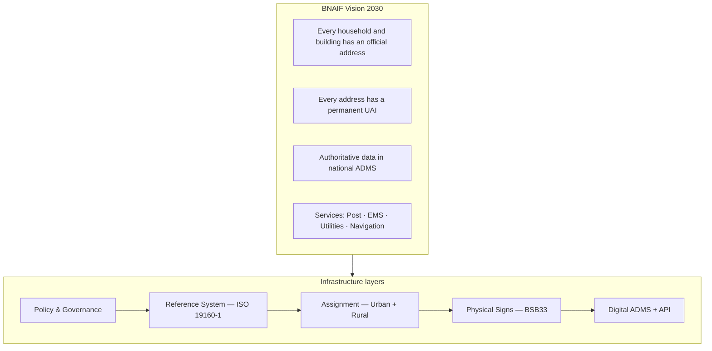

### 1.3 Coverage model

| Zone | Population context | Primary typology | Assigning authority | Address class family |
|------|-------------------|------------------|---------------------|----------------------|
| **Thromde (urban)** | Cities: Thimphu, Phuentsholing, Paro, Gelephu, Samdrup Jongkhar, etc. | `thoroughfare` | Thromde | `BT_Urban*` |
| **Thromde fringe / transition** | Peri-urban expansion | `thoroughfare` + `area` | Thromde + Gewog (joint) | `BT_RuralTransition` |
| **Gewog centre** | Small towns, gewog HQs | `thoroughfare` or `area` | Gewog administration | `BT_RuralTown` |
| **Rural settlement** | Chiwog / village clusters | `area` | Gewog + Gup office | `BT_RuralChiwog` |
| **Farmstead / isolated** | Scattered along gewog roads | `thoroughfare` (distance) | Gewog | `BT_RuralDistance` |
| **National highway** | Roadside facilities | `thoroughfare` | MoIT / DST + local | `BT_Highway` |

### 1.4 Strategic targets (indicative)

| KPI | Pilot (Year 1–2) | Phase 2 (Year 3–4) | National (Year 5+) |
|-----|------------------|--------------------|--------------------|
| Thromdes with live ADMS | 2 | 6 | All |
| Gewogs with rural addressing SOP | 4 | 20 | All |
| Addresses registered with UAI | 25,000 | 150,000 | 100% structures |
| ADMS update SLA (post-approval) | ≤ 7 days | ≤ 3 days | ≤ 24 hours |
| ISO 19160-3 quality — completeness | ≥ 85% | ≥ 92% | ≥ 98% |
| Open address API availability | Pilot read-only | National v1 | National v2 + changelog |

---

## 2. Abbreviations

### 2.1 Standards and technical terms

| Abbrev. | Full term | Meaning |
|---------|-----------|---------|
| **ADMS** | Address Data Management System | Authoritative system for address records, GIS, workflows, API |
| **ADS** | Advance Direction Sign | Pre-junction route sign (BSB33) |
| **API** | Application Programming Interface | Machine-readable address service |
| **BNAIF** | Bhutan National Addressing Infrastructure Framework | This document |
| **BUARS** | Bhutan Urban Address Reference System | Urban ISO 19160-1 profile |
| **BRRS** | Bhutan Rural Address Reference System | Rural ISO 19160-1 profile |
| **CC BY** | Creative Commons Attribution | Open-data licence model |
| **DQMP** | Data Quality Management Plan | ISO 19160-3 quality programme |
| **DS** | Direction Sign | Intersection direction sign |
| **GIS** | Geographic Information System | Spatial platform for roads, parcels, addresses |
| **GML** | Geography Markup Language | Geospatial exchange format |
| **KPI** | Key Performance Indicator | Programme success measure |
| **LADM** | Land Administration Domain Model | ISO 19152 — cadastre model |
| **NAD** | National Address Database | Central authoritative register |
| **RACI** | Responsible, Accountable, Consulted, Informed | Role assignment matrix |
| **SDMS** | Spatial Database Management System | Geometry-capable database |
| **SLA** | Service Level Agreement | Performance standard |
| **SOP** | Standard Operating Procedure | Documented process steps |
| **UAI** | Unique Address Identifier | Permanent national address ID |
| **UPU S42** | UPU Standard S42 | International postal address template |
| **URI** | Uniform Resource Identifier | ISO requirement identifier |

### 2.2 ISO 19160 series

| Part | Title | Role in BNAIF |
|------|-------|---------------|
| **ISO 19160-1:2015** | Conceptual model | Sections 6, 9 — address classes, components, lifecycle |
| **ISO 19160-2:2023** | Good practice & governance | Sections 5, 7–8, 15–16 — assignment rules, processes |
| **ISO 19160-3:2020** | Data quality | Section 13 — DQMP, measures, reporting |
| **ISO 19160-4:2023** | Postal components | Section 14 — Bhutan Post template |
| **ISO 19152:2012** | LADM | Section 19 — UAI ↔ parcel crosswalk |
| **ISO 19105:2022** | Conformance & testing | Appendix G — conformance mapping |

### 2.3 Bhutan administrative and local terms

| Term | Meaning |
|------|---------|
| **Thromde** | Municipal corporation / city |
| **Dzongkhag** | District (20 dzongkhags) |
| **Gewog** | Block / sub-district (205 gewogs) |
| **Chiwog** | Hamlet / village block within gewog |
| **Gup** | Gewog head / elected local leader |
| **Lam** | Urban street (Dzongkha suffix) |
| **DHS** | Department of Human Settlement |
| **MoIT** | Ministry of Infrastructure and Transport |
| **NLCS** | National Land Commission Secretariat |
| **DDC** | Dzongkha Development Commission |
| **BSB / BSB33** | Bhutan Standards Bureau / Road signage standard |
| **DST** | Department of Surface Transport |
| **DDM** | Department of Disaster Management |

---

## 3. National context and scope

### 3.1 Geographic context

Bhutan's settlement patterns create **two dominant addressing contexts**:

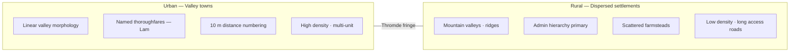

| Context attribute | Urban (Thromde) | Rural (Gewog) |
|-------------------|-----------------|----------------|
| Road network | Structured grid / valley linear | Gewog roads, farm tracks, occasional naming |
| Density | High — multi-storey, compounds | Low — isolated houses, chiwog clusters |
| Primary locator | Street + building number | Chiwog + house number (+ landmark) |
| Numbering basis | 10 m hybrid (odd/even) | Sequential within chiwog; 50 m distance on gewog roads |
| Signage density | BSB33 street + building signs | Finger posts, house plates, chiwog boards |
| Assigning authority | Thromde | Gewog administration (DHS oversight) |

### 3.2 Legal and policy context (to be formalized)

| Instrument | Role in addressing | Status |
|------------|-------------------|--------|
| **Thromde Act** (and municipal rules) | Urban street naming, building numbering authority | To be cited in Thromde by-laws |
| **Local Government Act** | Gewog / Dzongkhag planning and service delivery | Gewog addressing mandate |
| **Land Act / NLCS regulations** | Parcel identification, cadastral linkage | UAI ↔ parcel crosswalk |
| **National Addressing Policy** (proposed) | Overarching strategy, DHS leadership | **To be issued** |
| **This framework (BNAIF)** | Technical good practice per ISO 19160-2 Req 18 | This document |
| **Thromde Addressing By-law** (template) | Local implementation rules | Appendix C template |

### 3.3 Document scope and normative references

**In scope:** All addressable objects in the physical world within Bhutan — buildings, dwellings, institutional campuses, farmhouses, roadside facilities, and (Phase 3) selected public infrastructure ("Address of Things").

**Out of scope:** Virtual addresses, IP addresses, PO Box–only addresses without physical delivery point (Phase 2 extension), international addressing outside Bhutan.

**Normative references:**

| Standard | Citation |
|----------|----------|
| ISO 19160-1:2015 | Addressing — Part 1: Conceptual model |
| ISO 19160-2:2023 | Addressing — Part 2: Assigning and maintaining addresses |
| ISO 19160-3:2020 | Addressing — Part 3: Address data quality |
| ISO 19160-4:2023 | Addressing — Part 4: International postal address components |
| ISO 19152:2012 | Geographic information — LADM |
| ISO 8601 | Date/time representation |
| ISO 3166-1 | Country codes (`BT`) |
| BSB33:2017 | Road Safety Signs and Symbols |
| UPU S42 | International postal address template |

---

## 4. ISO 19160 alignment framework

### 4.1 Architecture overview

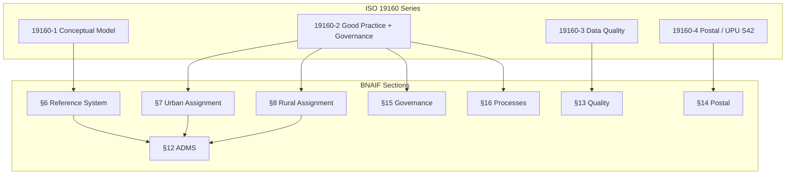

### 4.2 Conformance classes claimed

| ISO 19160-1 class | BNAIF claim | Mandatory from |
|-------------------|-------------|----------------|
| Core | Yes | Pilot |
| Lifecycle | Yes | Pilot |
| Locale (dz_BT + en_BT) | Yes | Pilot |
| Provenance | Yes | National rollout |
| Full | Target | ADMS v1.0 go-live |

| ISO 19160-2 class | BNAIF claim |
|-------------------|-------------|
| `GoodPractice` | Target at framework adoption |
| `GovernanceFramework` | Target at framework adoption + enabling legislation |

### 4.3 Requirement coverage summary

| ISO 19160-2 area | Req count | Addressed in BNAIF |
|------------------|-----------|-------------------|
| Good Practice — General (7.1) | 5 REQ + 5 REC | §5, §6, §11, §18 |
| Good Practice — Addressing (7.2.1) | 6 REQ + 3 REC | §7, §8, §9, §20 |
| Good Practice — Address data (7.2.2) | 4 REQ + 4 REC | §12–§14, §19 |
| Governance — General (8.1) | 3 REQ + 1 REC | §15 |
| Governance — Stakeholders (8.2) | 5 REQ | §17 |
| Governance — Processes (8.3) | 9 REQ + 1 REC | §16 |

Full mapping: [Appendix G](#appendix-g-iso-19160-2-conformance-map).

---

## 5. Objectives and principles

### 5.1 National objectives (ISO 19160-2 Req 1)

| ID | Objective | Primary beneficiaries | BNAIF section |
|----|-----------|----------------------|---------------|
| **O1** | Provide clear, unique addresses for every addressable structure | Citizens, visitors | §7, §8 |
| **O2** | Enable efficient postal, emergency, utility, and municipal service delivery | Bhutan Post, EMS, DDM, utilities | §14, §16 |
| **O3** | Integrate address data with GIS, cadastre, and national SDI | DHS, NLCS, Thromdes, Gewogs | §12, §19 |
| **O4** | Promote uniform address structures across all Thromdes and Gewogs | MoIT, DHS | §6–§8 |
| **O5** | Support digital mapping, GPS navigation, and e-commerce | Private sector, tourism | §12, §19 |
| **O6** | Extend formal addressing to rural and underserved areas for identity and services | Rural households (cf. SAPO objective, ISO Rec 1) | §8 |
| **O7** | Achieve public good through open address attributes (Rec 1) | All users | §18 |

### 5.2 Public-good statement (ISO Rec 1)

The Royal Government assigns and maintains addresses **for governance and public service delivery**. Address **attribute data** (street name, number, locality, admin areas, UAI) shall be openly available under the national address data licence (§18). Precise coordinates may be tier-licensed for privacy and security.

### 5.3 Core principles

| Principle | Urban application | Rural application |
|-----------|-------------------|-------------------|
| **Uniqueness** | Unique within thoroughfare + locality | Unique within chiwog (or road segment) |
| **Simplicity** | Street number + Lam + locality | Chiwog + house number + gewog |
| **Consistency** | Same 10 m model all Thromdes | Same chiwog numbering rules all Gewogs |
| **Scalability** | Reserved numbers, suffixes | Sequential pools per chiwog |
| **Geographic logic** | Distance from reference point | Admin hierarchy + optional road distance |
| **Device independence** (Req 8) | Visible signs; distance formula | House plate + chiwog signboard |
| **Sustainability** (Req 6) | 10 m gaps; alpha suffixes | Number pools; distance intervals |
| **No personal information** (Req 9) | No owner names in address | Same |
| **Digital equivalence** (Rec 7) | 1:1 UAI record per address | Same |

---

## 6. Address reference system (ISO 19160-1 profile)

### 6.1 Profile identification

| Field | Value |
|-------|-------|
| Profile name | **Bhutan National Address Reference System (BNARS)** |
| Sub-profiles | BUARS (urban) · BRRS (rural) |
| Developer | DHS / MoIT, Royal Government of Bhutan |
| Base standard | ISO 19160-1:2015 |
| Conformance | Core + Lifecycle + Locale (+ Provenance at national rollout) |

### 6.2 Conceptual model

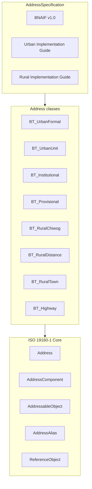

### 6.3 Optional ISO classes — BNARS constraints

| ISO 19160-1 class | Status |
|-------------------|--------|
| Address | Mandatory |
| AddressComponent | Mandatory (extended types) |
| AddressableObject | **Mandatory** |
| AddressSpecification | **Mandatory** |
| ReferenceObject | **Mandatory** |
| AddressAlias | **Mandatory** (urban corners; rural landmarks) |
| AddressedPeriod | Optional (reassignment history) |

### 6.4 Complete address class register

| Code | Typology | Zone | Description |
|------|----------|------|-------------|
| `BT_UrbanFormal` | thoroughfare | Thromde | Standard street-front building |
| `BT_UrbanUnit` | thoroughfare | Thromde | Unit/apartment (child address) |
| `BT_Institutional` | thoroughfare | Thromde | Campus / large parcel |
| `BT_Provisional` | thoroughfare | Thromde | Temporary / informal (unofficial) |
| `BT_AliasSecondary` | thoroughfare | Thromde | Corner / alternate entrance alias |
| `BT_RuralTransition` | area + thoroughfare | Fringe | Peri-urban extension of urban rules |
| `BT_RuralTown` | thoroughfare or area | Gewog HQ | Small town with named streets |
| `BT_RuralChiwog` | **area** | Rural | Chiwog + house number (primary rural class) |
| `BT_RuralDistance` | thoroughfare | Rural | Distance along gewog road (farmsteads) |
| `BT_RuralLandmark` | area | Rural | Landmark-dependent (transitional) |
| `BT_Highway` | thoroughfare | National | AH/PNH/SNH roadside facilities |
| `BT_RuralPostal` | service | Rural | Postal route addressing (Bhutan Post) |

### 6.5 Address component register

| Component type | ISO/BT | Value type | Urban | Rural |
|----------------|--------|------------|:-----:|:-----:|
| `addressedObjectIdentifier` | ISO | String (UAI) | M | M |
| `countryCode` | ISO | `BT` | M | M |
| `countryName` | ISO | String | M | M |
| `administrativeAreaName` | ISO | Dzongkhag name | O | M |
| `thromdeName` | BT ext. | String | M | — |
| `gewogName` | BT ext. | String | O | M |
| `chiwogName` | BT ext. | String | O | M |
| `localityName` | ISO | Neighborhood | M | O |
| `settlementName` | BT ext. | Village/hamlet | O | O |
| `thoroughfareName` | ISO | Street + suffix | M | O |
| `buildingNumber` | BT ext. | String | M | — |
| `houseNumber` | BT ext. | String | — | M |
| `floorLevel` | BT ext. | String | O* | — |
| `unitNumber` | BT ext. | String | O* | — |
| `buildingName` | BT ext. | String | O | O |
| `landmark` | BT ext. | String | O | O |
| `postcode` | ISO | String | M** | M** |
| `postOfficeName` | ISO | String | O | M*** |
| `mailRouteCode` | BT ext. | String | — | O |

\* Mandatory for `BT_UrbanUnit` only  
\** Mandatory when national postcode scheme active  
\*** Recommended for `BT_RuralPostal` (cf. NZ Mailtown concept)

### 6.6 Component scope hierarchy

**Urban (thoroughfare typology):**

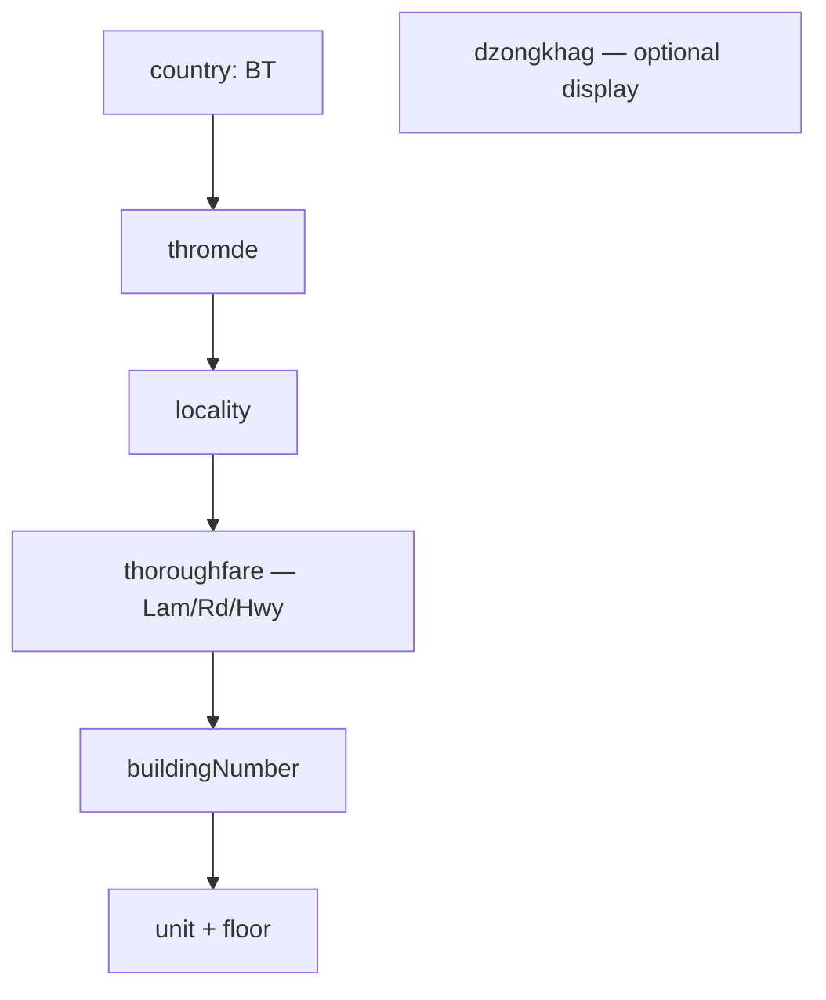

**Rural (area typology):**

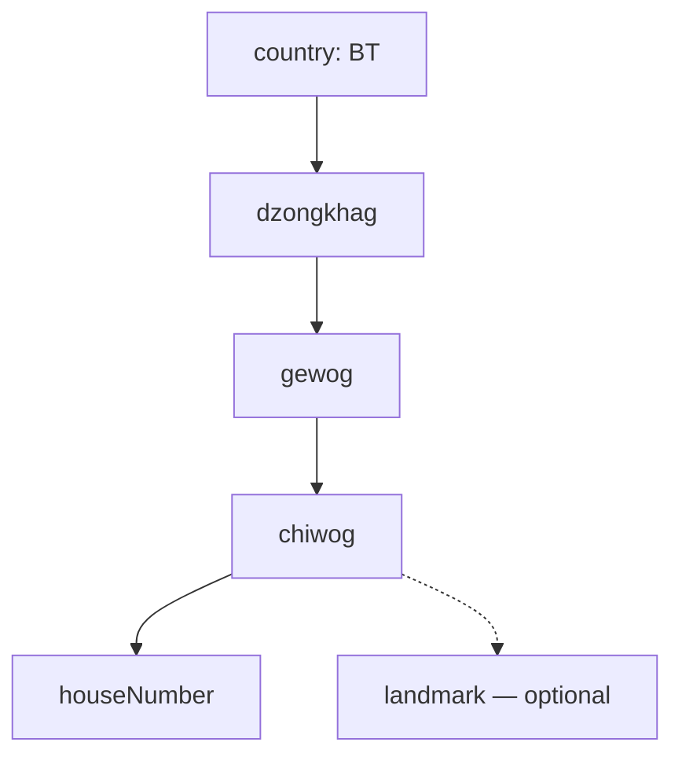

### 6.7 Locale model (ISO Locale conformance)

| Locale ID | Language | Script | Authority |
|-----------|----------|--------|-----------|
| `dz_BT` | Dzongkha | Tibetan | DDC — authoritative |
| `en_BT` | English | Latin | DDC transliteration rules |

Each display component stores separate `AddressComponentValue` records per locale with `type = localeAlternative`.

### 6.8 Lifecycle stages

**Address lifecycle (ISO AddressLifecycleStage):**

| Stage | Urban/Rural use |
|-------|-----------------|
| `proposed` | Application submitted |
| `current` | Approved and active |
| `reserved` | Number held for future access |
| `rejected` | Application denied |
| `retired` | Demolished / merged — **UAI never reused** |
| `unknown` | Legacy migration only |

**Addressable object lifecycle:**

| Stage | Use |
|-------|-----|
| `proposed` | Building permit / rural construction application |
| `approved` | Permit granted; number allocated |
| `underConstruction` | Address assigned; signage pending |
| `exists` | Occupied or complete |
| `ceasedToExist` | Demolished |
| `unknown` | Legacy data |

### 6.9 Position representation

| Position type | Urban | Rural |
|---------------|-------|-------|
| `streetFront` | Main entrance (default) | — |
| `accessPoint` | Driveway meets street | Farm track meets gewog road |
| `centroid` | Building footprint (GIS) | Structure centroid |
| `approximated` | Provisional / GPS survey pending | Initial rural rollout |
| `gateLocation` | Institutional main gate | Farm gate |

**Coordinate reference systems:** EPSG:4326 (WGS 84) for exchange; EPSG:5266 (Bhutan National Grid) for survey and storage.

---

## 7. Part I — Urban addressing (Thromde)

*Incorporates and formalizes the City Addressing Guideline.*

### 7.1 Applicability

Applies to all **Thromde** areas and designated urban zones within Dzongkhags. Assignment authority: **Thromde** (DHS national oversight).

### 7.2 Street order and reference system

#### 7.2.1 Reference point and baseline

| Element | Rule |
|---------|------|
| **Reference point** | City centre, city entrance, or major intersection — selected per Thromde master plan |
| **Numbering direction** | Outward from reference point; progressive increase |
| **Baseline** | Road intersecting reference point; defines NE/SE/SW/NW quadrants |
| **Street hierarchy** | Arterial → Collector → Local (determines sub-reference points) |

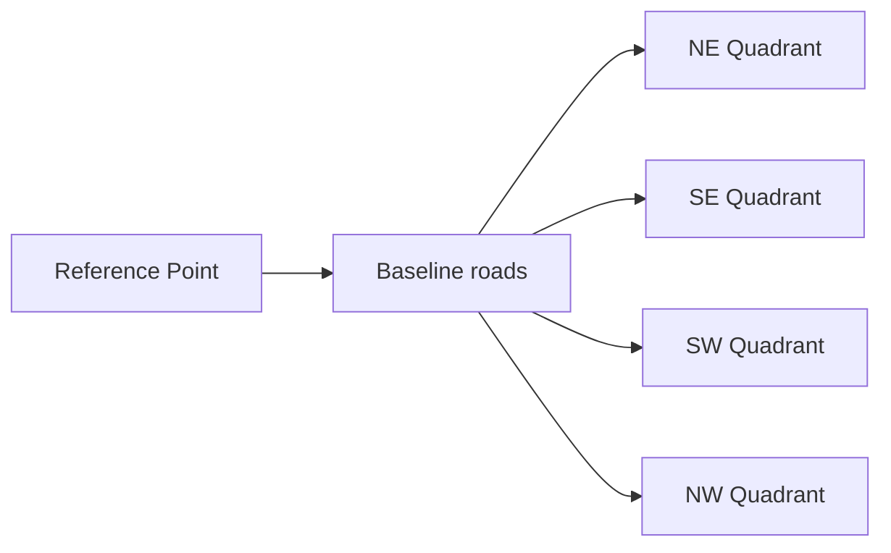

#### 7.2.2 Street naming eligibility

| Step | Question | No → Action |
|------|----------|-------------|
| 1 | Publicly accessible? | No street name; private driveway |
| 2 | Access to buildings/plots? | Name optional until development |
| 3 | Serves > 1 building AND length > 50 m? | Use primary street address |
| 4 | All yes | **Assign street name** |

#### 7.2.3 Street naming rules

| Rule | Requirement |
|------|-------------|
| Uniqueness | Unique within locality |
| Pronunciation | Easy to pronounce and spell |
| Culture | Reflect local geography/culture where appropriate |
| Suffix | Per road classification (see table below) |
| Retention | Retain existing names where possible |
| Prohibited | Living persons; companies; products; offensive names; punctuation |
| Authority | Thromde council (via naming SOP, §16) |
| DDC | Dzongkha authoritative; English transliteration |

| Road classification | Street type | Suffix |
|--------------------|-------------|--------|
| National Highway (AH, PNH, SNH) | Primary | **Hwy** |
| Dzongkhag road | Road | **Rd** |
| Thromde road | Urban street | **Lam** |
| Farm/access | Road | **Rd** |

### 7.3 Building numbering methodology

#### 7.3.1 Core rules

| Rule | Specification |
|------|---------------|
| **Model** | Hybrid valley addressing — **10 m unit** |
| **Formula (even)** | Distance = (Building No ÷ 2) × 10 m |
| **Formula (odd)** | Distance = [(Building No + 1) ÷ 2] × 10 m |
| **Odd/even** | Right side = Even; Left side = Odd (from reference) |
| **Reference (local streets)** | Intersection with higher-order street |
| **Sustainability** | 10 m gaps accommodate infill without renumbering |

#### 7.3.2 Exceptions to odd/even

| Condition | Numbering method |
|-----------|------------------|
| International boundary on one side | Consecutive all one side |
| River/cliff — no development one side | Consecutive |
| Dead-end street | Consecutive clockwise from entry |

#### 7.3.3 Multiple buildings on one plot

| Scenario | Rule |
|----------|------|
| Multiple buildings within same 10 m unit | Same number + **alphabetical suffix** (A, B, C) |
| Buildings beyond 10 m interval | Distance-based number |
| Enclosed plot, single access | Number at access point; internal suffixes |
| Future second access | Reserved distance number activated |

### 7.4 Unit and child addressing

See [Appendix I](#appendix-i-unit-and-child-addressing). Summary:

| Element | Rule |
|---------|------|
| Class | `BT_UrbanUnit` |
| Parent | `BT_UrbanFormal` address |
| Mandatory components | floorLevel + unitNumber |
| UAI | Parent UAI + unit suffix |
| Inheritance | Street, locality, thromde from parent |

### 7.5 Special urban cases

| Case | Class / mechanism | Rule |
|------|-------------------|------|
| Corner building | `BT_AliasSecondary` | Primary = main entrance street; reserve alternate |
| Multi-entrance (independent uses) | Multiple addresses or aliases | Per entrance use |
| Institutional campus | `BT_Institutional` | Main admin entrance; internal suffixes |
| Setback building | `accessPoint` position | Number at driveway–street intersection |
| Rural–urban transition | `BT_RuralTransition` | Extend urban numbering gradually |
| Temporary/informal | `BT_Provisional` | Unofficial; service delivery only; disclaimer applies |

**Provisional disclaimer (mandatory):** Provisional addressing does not confer legal status, ownership rights, or permanence.

### 7.6 Urban address class component matrix

See [Appendix A](#appendix-a-address-class-component-matrix) — urban columns.

---

## 8. Part II — Rural addressing (Dzongkhag / Gewog / Chiwog)

*New profile aligned with ISO area typology, NZ Rural Post Delivery, and SAPO rural addressing models.*

### 8.1 Applicability and authority

| Attribute | Specification |
|-----------|---------------|
| **Zone** | All areas outside Thromde boundaries, plus gewog centres not yet Thromde |
| **Assigning authority** | **Gewog administration** (Gup office) with DHS standards and NLCS verification |
| **Postal coordination** | Bhutan Post — routing codes and mail routes |
| **Objective O6** | Formal rural addresses for identity, post, EMS, utilities, financial services |

### 8.2 Rural addressing strategy

Bhutan rural addressing uses a **dual-mode model**:

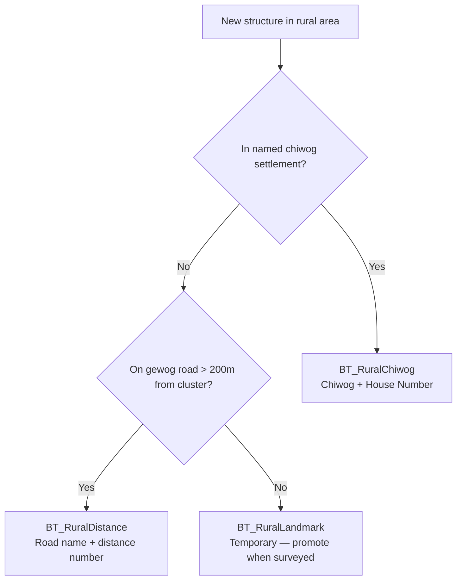

| Mode | When to use | Precision | Human friendliness |
|------|-------------|-----------|-------------------|
| **Chiwog-based** (`BT_RuralChiwog`) | Clustered villages | High within chiwog | High — admin names known locally |
| **Distance-based** (`BT_RuralDistance`) | Isolated farmsteads along roads | High along road axis | Medium — requires road km awareness |
| **Landmark** (`BT_RuralLandmark`) | Initial EMS response only | Low | High locally — **promote within 12 months** |
| **Gewog town** (`BT_RuralTown`) | Gewog HQ with street network | High | High — mirrors small urban |

### 8.3 Class BT_RuralChiwog (primary rural class)

#### 8.3.1 Structure

**Rendered format (English):**

> House 12, Bemithang Chiwog, Nanong Gewog, Pemagatshel Dzongkhag, Bhutan  
> UAI: BT-PG-NN-BM-0012-0001

| Component | Mandatory | Example |
|-----------|:---------:|---------|
| houseNumber | M | 12 |
| chiwogName | M | Bemithang |
| gewogName | M | Nanong |
| administrativeAreaName (Dzongkhag) | M | Pemagatshel |
| countryCode / countryName | M | BT / Bhutan |
| postcode | M* | *(Bhutan Post)* |
| settlementName | O | *(if different from chiwog)* |
| landmark | O | Near community lhakhang |
| buildingName | O | *(farm name)* |

#### 8.3.2 House numbering rules

| Rule | Specification |
|------|---------------|
| **Scope** | Unique within chiwog |
| **Assignment order** | Sequential from 1, assigned at first occupancy/permit |
| **Gaps** | Leave gaps of 2 between numbers for infill (sustainability, Req 6) |
| **Multi-structure plot** | Base number + suffix (12A, 12B) |
| **Chiwog boundary change** | UAI retained; admin components updated with provenance |
| **New chiwog** | DHS + Dzongkhag approval; code registered in Appendix B |

#### 8.3.3 Physical identification

| Identifier | Specification |
|------------|---------------|
| **House plate** | Minimum 150 × 100 mm; house number + chiwog (Dzongkha primary); mounted at entrance |
| **Chiwog signboard** | At chiwog entry; Dzongkha + English; gewog/dzongkhag on secondary line |
| **Finger post** | At gewog road junctions listing chiwogs (BSB33 rural guide sign style) |

### 8.4 Class BT_RuralDistance (farmstead / roadside)

For structures **> 200 m from chiwog cluster** or without chiwog settlement membership, along a **named gewog road**.

**Rendered format:**

> House 35, Chapcha Gewog Road, Chapcha Gewog, Chukha Dzongkhag, Bhutan  
> UAI: BT-CK-CP-GR-0035-0001

| Component | Rule |
|-----------|------|
| houseNumber | Distance-based: **50 m unit** from gewog road origin (cf. AS/NZS 4819 rural) |
| thoroughfareName | `{Name} Gewog Rd` or official DST road name |
| Odd/even | Left odd / right even from origin junction |
| Origin | Junction with PNH or gewog centre reference |
| Position | `accessPoint` at farm track meeting gewog road |

**Distance formula (50 m unit):**

| Side | Formula |
|------|---------|
| Even | Distance (m) = (House No ÷ 2) × 50 |
| Odd | Distance (m) = [(House No + 1) ÷ 2] × 50 |

### 8.5 Class BT_RuralTown (gewog centres)

Gewog centres with developed street networks may adopt **urban-style** addressing:

| Criterion | Threshold |
|-----------|-----------|
| Named streets | ≥ 3 public streets |
| Built structures | ≥ 50 addressed buildings |
| Authority | Gewog + DHS approval to adopt BUARS rules locally |

Uses `BT_RuralTown` or promotes to Thromde addressing if municipality status granted.

### 8.6 Class BT_Highway (national roads)

| Element | Rule |
|---------|------|
| Applicability | Fuel stations, checkpoints, rest areas, emergency shelters on AH/PNH/SNH |
| Format | `{Building No} {Highway Designation} km {chainage or locality}` |
| Authority | DST + local Thromde/Gewog |
| Class | `BT_Highway` |

### 8.7 Class BT_RuralPostal (service typology)

Aligned with ISO `service` typology and NZ Rural Post Delivery:

| Component | Purpose |
|-----------|---------|
| `postOfficeName` | Serving post office (cf. NZ **Mailtown**) |
| `mailRouteCode` | Bhutan Post delivery route ID |
| `houseNumber` + admin hierarchy | Delivery point |

Bhutan Post maintains route tables cross-referenced to UAI.

### 8.8 Rural–urban transition (BT_RuralTransition)

| Rule | Specification |
|------|---------------|
| Zone | 500 m buffer beyond current Thromde boundary (configurable) |
| Method | Urban 10 m numbering extends along primary access; chiwog addressing retained in parallel until Thromde annexation |
| UAI | Single UAI — class changes on formalization; no reissue |

### 8.9 Rural governance specifics

| Task | Responsible | Accountable |
|------|-------------|-------------|
| Chiwog house numbering | Gewog tshogpa / address focal | Gup |
| Chiwog boundary definition | Gewog + Dzongkhag | DHS |
| House plate compliance | Household owner | Gewog inspection |
| ADMS data entry | Gewog clerk | DHS |
| NLCS parcel link | NLCS field team | NLCS |

### 8.10 Rural address examples

See [Appendix H.3–H.5](#appendix-h-address-instance-examples).

---

## 9. Unique Address Identifier (UAI) — national scheme

### 9.1 Design principles

| Principle | Rule |
|-----------|------|
| Permanence | Never reused; survives renames and reclassifications |
| Universality | Every official address has exactly one UAI |
| Interoperability | Golden key for ADMS, NLCS, Bhutan Post, EMS |
| Human-readable | Structured string — not a substitute for postal address |

### 9.2 UAI structure

**Urban:**

```
BT-{TH}-{LOC}-{BLD}-{SEQ}[-{UNIT}]
```

**Rural (chiwog):**

```
BT-{DZ}-{GW}-{CW}-{HNO}-{SEQ}
```

**Rural (distance / road):**

```
BT-{DZ}-{GW}-{RD}-{HNO}-{SEQ}
```

| Segment | Length | Description | Example |
|---------|--------|-------------|---------|
| `BT` | 2 | ISO 3166-1 alpha-2 | BT |
| `{TH}` | 2 | Thromde code | TH = Thimphu |
| `{DZ}` | 2 | Dzongkhag code | PG = Pemagatshel |
| `{GW}` | 2–3 | Gewog code | NN = Nanong |
| `{CW}` | 2–3 | Chiwog code | BM = Bemithang |
| `{LOC}` | 2–4 | Urban locality code | CH = Changjiji |
| `{BLD}` / `{HNO}` | 4 | Zero-padded number | 0124 / 0012 |
| `{RD}` | 2 | Road segment code | GR = Gewog Road |
| `{SEQ}` | 4 | Disambiguation sequence | 0001 |
| `{UNIT}` | var | Unit suffix | U05 |

### 9.3 National code register

Maintained by DHS; published in [Appendix B](#appendix-b-administrative-code-register). Thromde and Dzongkhag codes assigned on framework adoption.

### 9.4 External identifier crosswalk

| System | ID | Cardinality | Notes |
|--------|-----|-------------|-------|
| NLCS cadastre | Parcel ID | 1:1 primary | Multi-parcel campuses: 1:n with note |
| Bhutan Post | Delivery point ID | n:1 postcode area | |
| Thromde/Gewog GIS | Feature GUID | 1:1 | |
| Building permit | Permit number | n:1 | Provenance link |
| National population register | *(future)* | n:1 household | Phase 3 |

---

## 10. Address formats and rendering

### 10.1 Urban rendered formats

| Class | English template | Example |
|-------|------------------|---------|
| UrbanFormal | `{Unit/ Floor} {BldNo} {Street}, {Locality}, {Thromde}, {Postcode}, Bhutan` | 124 Chang Lam, Changjiji, Thimphu, Bhutan |
| UrbanUnit | `Level {f} — Unit {u}, {BldNo} {Street}, {Locality}, {Thromde}, Bhutan` | Level 1 — Unit 05, 87 Phenday Lam, Kabraytar, Phuentsholing, Bhutan |

### 10.2 Rural rendered formats

| Class | English template | Example |
|-------|------------------|---------|
| RuralChiwog | `House {hn}, {Chiwog} Chiwog, {Gewog} Gewog, {Dzongkhag}, Bhutan` | House 12, Bemithang Chiwog, Nanong Gewog, Pemagatshel, Bhutan |
| RuralDistance | `House {hn}, {Road}, {Gewog} Gewog, {Dzongkhag}, Bhutan` | House 35, Chapcha Gewog Rd, Chapcha Gewog, Chukha, Bhutan |

### 10.3 Mandatory vs optional by class

Full matrix: [Appendix A](#appendix-a-address-class-component-matrix).

### 10.4 Address rendering rules

| Rule | Specification |
|------|---------------|
| Dzongkha | Primary on signage and official gazette |
| English | Transliteration per DDC; required on urban street signs |
| UAI | Not rendered on public signage; required in ADMS and official correspondence |
| Postcode | When active: mandatory last line before country in postal mail |

---

## 11. Physical identifiers and signage

### 11.1 Standards basis

All public addressing signage shall conform to **BSB33:2017** (Road Safety Signs and Symbols) and BNAIF specifications below.

### 11.2 Sign type register

| Sign type | Zone | BSB33 ref | Key elements |
|-----------|------|-----------|--------------|
| Street name (DS) | Urban | 4.3 | Dzongkha above English; blue (Thromde) / green (Hwy) |
| Advance direction (ADS) | Urban | 4.3 | Junction preview 300–500 m before |
| Reassurance direction | Urban | 4.3 | 500–1000 m after junction |
| Building number plate | Urban | BNAIF ext. | Black/gold; at main entrance |
| Unit number plate | Urban | BNAIF ext. | Black/white; at unit entrance |
| Chiwog finger post | Rural | 4.3 | Finger post per City Guideline §11 |
| Chiwog boundary board | Rural | BNAIF ext. | Chiwog + gewog + dzongkhag |
| House number plate | Rural | BNAIF ext. | House no. + chiwog name |
| Highway facility sign | Highway | 4.3 | Green background |

### 11.3 Typography

| Element | Dzongkha | English |
|---------|----------|---------|
| Typeface | Joyig / Lhoyig / Drukyig | Highway Gothic Series D |
| Relative size | **Equal visual appearance** (resolve BSB33 4.3.2.1 conflict in favour of equal legibility) |
| Stroke | 13–18% of x-height | Same |
| Transliteration | DDC authoritative | — |

### 11.4 Retroreflectivity and materials

| Element | Specification |
|---------|---------------|
| Retroreflective sheet | ASTM Type III/IV high intensity prismatic |
| Sign plate | 5052-H38 aluminium, 2.0 mm |
| Pole | GI pipe 50 mm × 3.25 mm |
| Building plates | Owner choice subject to Gewog/Thromde approval; weather-durable |

### 11.5 Mounting heights (BSB33)

| Location | Lower edge height |
|----------|-------------------|
| Carriageway edge | 900–1500 mm |
| Footpath | **2300 mm** (recommended) |

### 11.6 Physical–digital sync (ISO Rec 5)

| Event | Physical action | Digital action | SLA |
|-------|-----------------|----------------|-----|
| Address approved | Order signs | ADMS `proposed` → `current` | 7 days |
| Sign installed | Inspection | ADMS `signInstalled = true` | 90 days from approval |
| Address changed | Replace signs | ADMS version++ | 7 days |
| Address retired | Remove/sign deface | ADMS `retired` | 14 days |

---

## 12. Address Data Management System (ADMS)

### 12.1 Architecture

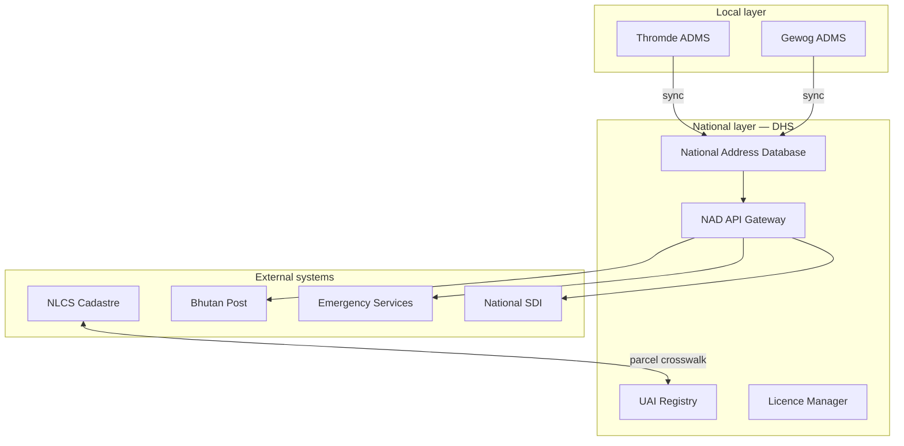

### 12.2 Functional requirements (ISO Req 15)

| Function | Requirement |
|----------|-------------|
| CRUD | Create, read, update, retire addresses with lifecycle |
| Geometry | Store point (entrance) + optional footprint polygon |
| Locale | Bilingual component values |
| Provenance | Full audit trail — who, when, why |
| Workflow | Initiation → approval pipeline (§16) |
| Versioning | Increment on every change (ISO Lifecycle Req 3) |
| Search | By UAI, component, bounding box, admin area |
| Export | GML, GeoJSON, CSV, ISO 19160-1 logical model |
| API | REST — read public; write authenticated (Rec 12) |

### 12.3 Minimum record schema

See [Appendix D](#appendix-d-adms-data-dictionary).

### 12.4 Sync model

| Tier | Direction | Frequency |
|------|-----------|-----------|
| Local → National | Thromde/Gewog to NAD | **Event-driven** (on approval) + weekly batch |
| National → Subscribers | NAD to Post/EMS/NLCS | Daily delta + monthly full |
| Minimum reporting | Bi-annual DHS report | Retained as audit minimum |

---

## 13. Data quality framework (ISO 19160-3)

### 13.1 Quality policy

DHS publishes an annual **Address Data Quality Report** conformant to ISO 19160-3 (Rec 11).

### 13.2 Quality dimensions and measures

| ISO 19160-3 element | Measure | Urban target | Rural target |
|---------------------|---------|:------------:|:------------:|
| **Completeness** | % addresses with all mandatory components | 98% | 90% → 95% |
| **Completeness** | % with entrance geometry | 95% | 85% |
| **Logical consistency** | % UAI unique | 100% | 100% |
| **Accuracy — positional** | RMSE vs survey (m) | ≤ 3 m | ≤ 10 m |
| **Accuracy — attribute** | % street names match DDC | 100% | N/A |
| **Temporal quality** | % updated within SLA | 95% | 90% |
| **Usage** | Subscriber count / API calls | KPI tracked | KPI tracked |

Full measure register: [Appendix E](#appendix-e-iso-19160-3-quality-measures).

### 13.3 Quality assurance workflow


---

## 14. Postal addressing (ISO 19160-4 / UPU S42)

### 14.1 Bhutan Post template (proposed)

Co-developed with Bhutan Post; profiles ISO 19160-4.

**Urban postal lines:**

| Line | Component |
|------|-----------|
| 1 | Addressee name *(external to address model)* |
| 2 | Unit/Floor + Building + Street |
| 3 | Locality + Postcode |
| 4 | Thromde |
| 5 | BHUTAN |

**Rural postal lines:**

| Line | Component |
|------|-----------|
| 1 | Addressee name |
| 2 | House number + Building name (optional) |
| 3 | Chiwog + Gewog + Postcode |
| 4 | Dzongkhag |
| 5 | BHUTAN |

Full template: [Appendix F](#appendix-f-bhutan-postal-address-template-upu-s42-profile).

### 14.2 Postcode structure (proposed — subject to Bhutan Post)

| Digit position | Meaning | Example |
|----------------|---------|---------|
| 1 | Region (east/central/west/south) | 1 = West |
| 2–3 | Dzongkhag or Thromde zone | 10 = Thimphu |
| 4–5 | Delivery area / locality | 01 = Changjiji |

Example: `11001` — Thimphu, Changjiji area.

---

## 15. Governance framework (ISO 19160-2 Clause 8)

### 15.1 National Addressing Strategy (Req 16)

| Phase | Focus | Duration |
|-------|-------|----------|
| **Phase 0** | Framework adoption, legislation, pilot design | 0–6 months |
| **Phase 1** | Urban pilot — Thimphu + Phuentsholing | 6–24 months |
| **Phase 2** | Rural pilot — 4 gewogs; NAD v1 | 12–36 months |
| **Phase 3** | National rollout — all Thromdes | 24–60 months |
| **Phase 4** | Complete rural coverage | 36–84 months |
| **Phase 5** | Continuous improvement + ISO conformance audit | Ongoing |

### 15.2 Policy hierarchy (Req 17)

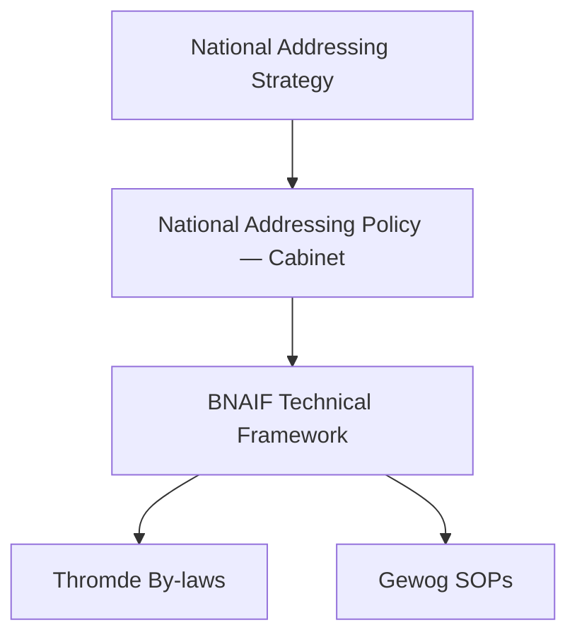

### 15.3 Good practice incorporation (Req 18)

This BNAIF document **is** the mandated good practice for address assignment and maintenance in Bhutan, referenced by National Addressing Policy and local by-laws.

---

## 16. Lifecycle processes and RACI

### 16.1 Process overview (ISO Figure 9)

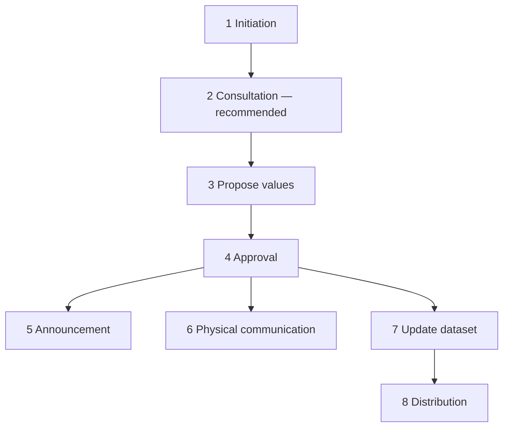

### 16.2 Process specifications

#### Process 1 — Initiation (Req 26)

| Attribute | Urban | Rural |
|-----------|-------|-------|
| **Trigger** | Building permit application; subdivision; street construction | New construction; chiwog settlement survey; farmstead registration |
| **Initiator** | Developer / owner / Thromde planner | Household / Gup / gewog clerk |
| **Output** | Initiation record in ADMS (`lifecycleStage = proposed`) | Same |
| **SLA** | Log within 2 working days of trigger | Log within 5 working days |

#### Process 2 — Consultation (Rec 14)

| Attribute | Specification |
|-----------|---------------|
| **When** | New street name; street rename; chiwog boundary change |
| **Method** | 21-day public notice (website + gewog board); stakeholder comments |
| **Participants** | DDC (Dzongkha); residents; RBP; Bhutan Post |
| **Output** | Consultation report attached to proposal |

#### Process 3 — Propose values (Req 27)

| Attribute | Specification |
|-----------|---------------|
| **Urban** | Thromde planner proposes street name + building number using §7 rules |
| **Rural** | Gewog clerk proposes chiwog house number using §8 rules |
| **Tool** | ADMS proposal form (Appendix C.1) |
| **Validation** | Automated GIS check — uniqueness, geometry, component completeness |

#### Process 4 — Approval (Req 28)

| Attribute | Urban | Rural |
|-----------|-------|-------|
| **Authority** | Thromde engineering committee / executive | Gup + gewog tshogde |
| **Decision** | Approve / reject / approve with conditions | Same |
| **SLA** | 30 calendar days | 30 calendar days |
| **Appeal** | Thromde Thrompon | Dzongkhag Dungkhag |

#### Process 5 — Announcement (Req 29)

| Attribute | Specification |
|-----------|---------------|
| **Channels** | National Address Portal; Royal Gazette (renames); gewog/chiwog notice board |
| **Content** | UAI, full address, effective date, map |
| **SLA** | Within 7 days of approval |

#### Process 6 — Physical communication (Req 30)

| Attribute | Urban | Rural |
|-----------|-------|-------|
| **Action** | Install street + building signs | Install house plate + update chiwog board |
| **Responsibility** | Thromde (street); owner (building) | Owner (house plate); Gewog (chiwog board) |
| **Inspection** | Thromde signage officer | Gewog tshogpa |
| **SLA** | 90 days from approval | 90 days from approval |

#### Process 7 — Update dataset (Req 31)

| Attribute | Specification |
|-----------|---------------|
| **Action** | ADMS record → `current`; publish geometry; version increment |
| **Responsible** | Thromde/Gewog ADMS operator |
| **SLA** | **≤ 7 days** from approval (target 24 h at national maturity) |

#### Process 8 — Distribution (Req 32)

| Attribute | Specification |
|-----------|---------------|
| **Subscribers** | Bhutan Post, EMS, DDM, NLCS, RBP, utilities, API users |
| **Method** | Automated webhook + daily delta file |
| **SLA** | ≤ 24 h after ADMS update |

### 16.3 Master RACI matrix

| Task | DHS | MoIT | Thromde | Gewog | NLCS | Bhutan Post | DDC | BSB | Owner |
|------|:---:|:----:|:-------:|:-----:|:----:|:-----------:|:---:|:---:|:-----:|
| National policy | A/R | C | I | I | C | C | C | I | I |
| Urban street naming | C | I | A/R | — | I | C | C | I | I |
| Urban numbering | C | I | A/R | — | C | I | I | I | C |
| Rural chiwog numbering | A | I | I | R | C | C | C | I | C |
| UAI issuance | A/R | I | R | R | C | I | — | — | — |
| ADMS operation | A | I | R | R | C | I | — | — | — |
| Signage standards | C | I | R | R | — | — | C | A | C |
| Sign installation (building) | I | — | C | C | — | — | — | — | R |
| Quality reporting | A/R | I | C | C | C | C | — | — | — |
| Postcode assignment | C | I | I | I | — | A/R | — | — | — |
| Parcel crosswalk | C | I | C | C | A/R | — | — | — | — |
| Public consultation | C | I | R | R | — | C | C | — | I |

*R = Responsible · A = Accountable · C = Consulted · I = Informed*

---

## 17. Stakeholders and institutional architecture

### 17.1 Stakeholder register (Req 19)

| Stakeholder | Role | Governance? |
|-------------|------|:-----------:|
| DHS / MoIT | National policy, UAI registry, NAD, quality | Yes |
| Thromdes | Urban assignment, signage, local ADMS | Yes |
| Dzongkhag administrations | Rural oversight, dispute resolution | Yes |
| Gewog administrations | Rural assignment, house plates | Yes |
| NLCS | Cadastre crosswalk, parcel verification | Yes |
| Bhutan Post | Postcode, postal template, delivery routes | Yes |
| DDC | Dzongkha names, transliteration | Yes |
| BSB | Signage materials standards | Yes |
| DST / MoIT | Highway naming, road classification | Yes |
| DDM / EMS / Fire | Address data subscriber | Partial |
| RBP | Crime analysis, emergency | Partial |
| Utilities (BPC, BT, water) | Service connection addressing | Partial |
| NLCS / NLC | Land registration | Yes |
| Citizens / households | Consultation; plate maintenance | Partial |
| Private navigators | API licence holders | No |
| Banks / financial institutions | KYC addressing | No |

### 17.2 Institutional diagram

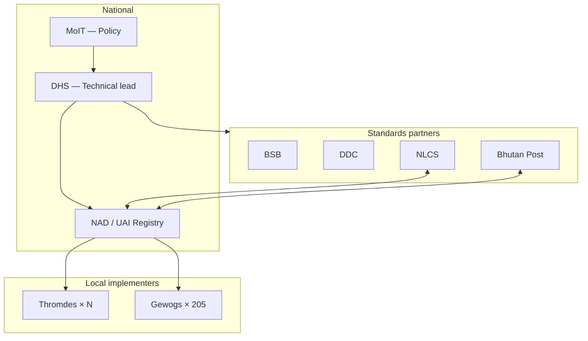

### 17.3 Resourcing (Req 22–23)

| Role | FTE per Thromde (indicative) | FTE per Gewog (indicative) |
|------|------------------------------|----------------------------|
| Addressing officer | 2–4 | 0.25 (shared focal) |
| GIS / ADMS operator | 1–2 | 0.1 |
| Signage inspector | 1 | 0.1 |
| **Budget lines** | Signage, GIS licence, plates, training | House plates, chiwog boards, training |

Funding: embedded in **Five-Year Plan** and municipal/gewog annual budgets (operational expense, not project-only).

---

## 18. Intellectual property and data licensing

### 18.1 IP ownership (Rec 3)

| Asset | Owner |
|-------|-------|
| Address assignment methodology (BNAIF) | Royal Government of Bhutan |
| UAI registry | DHS (MoIT) |
| Address attribute data | Crown / RGoB |
| Thromde/Gewog local extensions | RGoB |

Government agencies have **free unlimited access** for health, safety, welfare, and emergency services.

### 18.2 Data licence tiers (Req 4)

| Tier | User class | Attributes | Coordinates | Licence |
|------|------------|------------|-------------|---------|
| **T0 — Open** | Public, researchers, navigators | All text components, UAI, postcode | Rounded to 100 m | **CC BY 4.0** |
| **T1 — Standard** | Registered commercial API users | Full attributes | Full precision | RGoB Open Data Licence + registration |
| **T2 — Government** | Agencies (Post, EMS, NLCS, utilities) | Full | Full | MoU — no fee |
| **T3 — Restricted** | Security-sensitive | Case-by-case | Controlled | Written agreement |

---

## 19. Interoperability and national spatial data infrastructure

### 19.1 Integration architecture (Req 13)

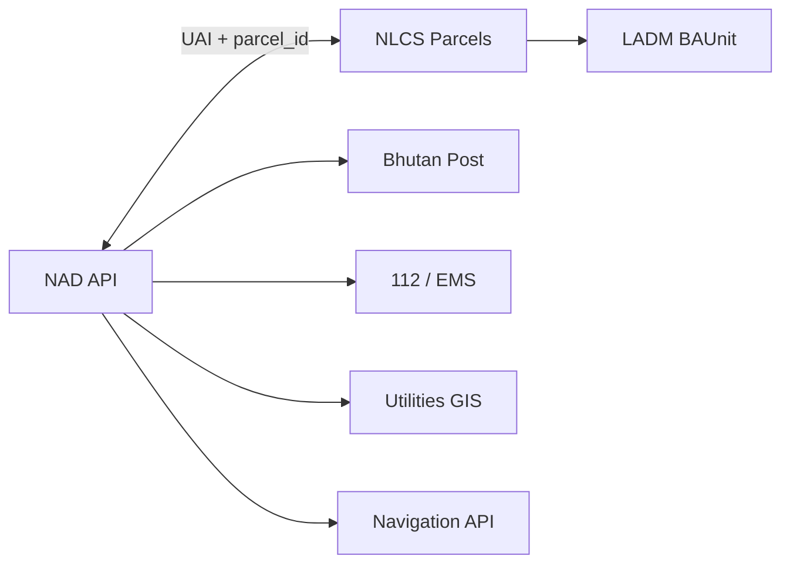

### 19.2 Exchange formats

| Format | Use case |
|--------|----------|
| GeoJSON / GML 3.2 | Spatial exchange |
| JSON-LD + ISO 19160-1 logical model | Semantic interoperability |
| CSV | Bulk download |
| WFS 2.0 / OGC API Features | Live spatial query |

### 19.3 API endpoints (indicative)

| Endpoint | Method | Description |
|----------|--------|-------------|
| `/v1/addresses/{uai}` | GET | Single address record |
| `/v1/addresses/search` | GET | Component / bbox search |
| `/v1/addresses/changes` | GET | Delta since timestamp |
| `/v1/admin/codes` | GET | Dzongkhag/gewog/chiwog register |

---

## 20. Pilot programme and evaluation

### 20.1 Pilot design (Req 7 — mandatory)

| Pilot | Location | Scope | Duration |
|-------|----------|-------|----------|
| **Urban A** | Thimphu — Changjiji / Norzin | 5,000 addresses | 18 months |
| **Urban B** | Phuentsholing — Kabraytar | 3,000 addresses | 18 months |
| **Rural A** | Pemagatshel — Nanong gewog (2 chiwogs) | 800 households | 18 months |
| **Rural B** | Chukha — Chapcha gewog (distance mode) | 400 farmsteads | 18 months |

### 20.2 Evaluation KPIs

| KPI | Pass threshold |
|-----|----------------|
| EMS response time improvement | ≥ 15% reduction in address-finding delay |
| Postal delivery success rate | ≥ 90% first-pass delivery |
| Citizen comprehension (survey) | ≥ 80% can state their official address |
| ADMS SLA compliance | ≥ 90% within 7-day update |
| Quality completeness | ≥ 85% mandatory fields |
| Signage compliance | ≥ 80% plates installed within 90 days |
| UAI ↔ parcel match rate | ≥ 75% in pilot zones |

### 20.3 Pilot exit criteria

National rollout authorized when **all four pilots** pass exit criteria and independent ISO conformance review confirms no blocking gaps.

---

## 21. National implementation roadmap

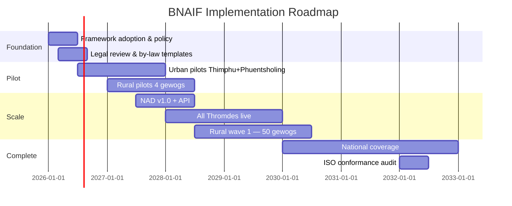

| Year | Milestone |
|------|-----------|
| **2026 H1** | BNAIF v1.0 adopted; National Addressing Policy issued |
| **2026 H2** | Pilot launch; UAI registry operational; Thromde ADMS procured |
| **2027** | Rural pilot; Bhutan Post postcode scheme; NLCS crosswalk live in pilots |
| **2028** | NAD API public; 6 Thromdes; 50 gewogs |
| **2029** | All Thromdes; 150 gewogs; annual quality report published |
| **2030+** | Full rural coverage; ISO 19160 conformance certification target |

---

## 22. Conclusion

The **Bhutan National Addressing Infrastructure Framework** provides a complete, ISO-aligned foundation for addressing **every household and building** in Bhutan — from Thimphu's valley streets to remote chiwogs and farmsteads along gewog roads.

It retains Bhutan's distinctive **10 m urban numbering**, **bilingual BSB33 signage**, and **Dzongkha-first** naming while adding the infrastructure elements required for international interoperability: a formal **ISO 19160-1 profile**, mandatory **UAI**, **governance lifecycle processes**, **national ADMS**, **rural address classes**, and **open data licensing**.

Implementation shall begin with **mandatory pilots** (ISO Req 7) before national rollout, ensuring the framework serves governance, public service delivery, and the public good (ISO Rec 1) for current and future generations.

---

# Appendices

## Appendix A: Address class component matrix

| Component | UF | UU | UI | UP | AS | RT | RC | RD | RTw | HW |
|-----------|:--:|:--:|:--:|:--:|:--:|:--:|:--:|:--:|:---:|:--:|
| uai | M | M | M | M | M | M | M | M | M | M |
| buildingNumber | M | inh | M | M | sh | O | — | — | M | M |
| houseNumber | — | — | — | — | — | — | M | M | O | O |
| thoroughfareName | M | inh | M | O | M | O | O | M | M | M |
| localityName | M | inh | M | M | sh | O | O | O | M | O |
| thromdeName | M | inh | M | M | sh | M | — | — | — | — |
| gewogName | O | O | O | O | O | M | M | M | M | O |
| chiwogName | — | — | — | — | — | O | M | O | O | — |
| administrativeAreaName | O | O | O | O | O | M | M | M | M | M |
| floorLevel | O | M | O | — | O | — | — | — | O | — |
| unitNumber | O | M | O | — | O | — | — | — | O | — |
| postcode | M* | M* | M* | O | M* | M* | M* | M* | M* | M* |
| landmark | O | O | O | O | O | O | O | O | O | M |
| postOfficeName | O | O | O | O | O | M | M | M | O | O |

*UF=UrbanFormal · UU=UrbanUnit · UI=Institutional · UP=Provisional · AS=Alias · RT=RuralTransition · RC=RuralChiwog · RD=RuralDistance · RTw=RuralTown · HW=Highway · inh=inherited · sh=shared · M*=mandatory when postcode active*

---

## Appendix B: Administrative code register

*(Indicative — to be populated by DHS on adoption)*

### B.1 Thromde codes

| Code | Thromde | Dzongkhag |
|------|---------|-----------|
| TH | Thimphu | Thimphu |
| PH | Phuentsholing | Chukha |
| PR | Paro | Paro |
| GE | Gelephu | Sarpang |
| SJ | Samdrup Jongkhar | Samdrup Jongkhar |

### B.2 Dzongkhag codes (sample)

| Code | Dzongkhag |
|------|-----------|
| TH | Thimphu |
| CK | Chukha |
| PG | Pemagatshel |
| BT | Bumthang |
| WP | Wangdue Phodrang |

### B.3 Gewog / Chiwog codes

Registered per gewog on rural rollout. Format: 2–3 alphanumeric assigned by DHS; unique within dzongkhag.

---

## Appendix C: Process forms and SLAs

### C.1 Address proposal form (minimum fields)

| Field | Required |
|-------|:--------:|
| Applicant name / org | M |
| Trigger type (permit / subdivision / rural registration) | M |
| Proposed address class | M |
| Proposed components (all mandatory for class) | M |
| Geometry (point) | M |
| NLCS parcel ID (if known) | O |
| Supporting documents | O |

### C.2 SLA summary

| Process step | SLA |
|--------------|-----|
| Initiation logging | 2–5 working days |
| Consultation period | 21 calendar days |
| Approval decision | 30 calendar days |
| Announcement | 7 days post-approval |
| ADMS update | 7 days post-approval |
| Signage installation | 90 days post-approval |
| Distribution to subscribers | 24 h post-ADMS update |

---

## Appendix D: ADMS data dictionary

| Field | Type | ISO mapping | Mandatory |
|-------|------|-------------|:---------:|
| `uai` | string(32) | Address.id | M |
| `address_class` | enum | Address.class | M |
| `status` | enum | Address.status | M |
| `lifecycle_stage` | enum | Address.lifecycleStage | M |
| `valid_from` | datetime | Lifespan.validFrom | M |
| `valid_to` | datetime | Lifespan.validTo | O |
| `version` | integer | Lifespan.version | M |
| `assigning_authority_org` | string | Provenance | M |
| `parent_uai` | string | parentAddress.id | O |
| `preference_level` | integer | preferenceLevel | O |
| `locale_dz` | jsonb | component values dz_BT | M |
| `locale_en` | jsonb | component values en_BT | M |
| `geom_entrance` | point | AddressPosition | M |
| `geom_footprint` | polygon | AddressableObject | O |
| `parcel_id` | string | ReferenceObject | O |
| `thromde_code` | string | scope filter | O |
| `dzongkhag_code` | string | scope filter | M |
| `gewog_code` | string | scope filter | O |
| `chiwog_code` | string | scope filter | O |
| `sign_installed` | boolean | local extension | O |
| `created_at` / `updated_at` | datetime | audit | M |

---

## Appendix E: ISO 19160-3 quality measures

| Measure ID | Name | Formula / method | Reporting |
|------------|------|------------------|-----------|
| DQ-001 | Completeness — mandatory components | complete_records / total_records | Quarterly |
| DQ-002 | Completeness — geometry | records_with_entrance / total | Quarterly |
| DQ-003 | Positional accuracy | RMSE of survey check sample | Annual |
| DQ-004 | Temporal — update SLA | updates_within_sla / total_updates | Monthly |
| DQ-005 | Unique UAI | duplicate_uai_count (target 0) | Daily automated |
| DQ-006 | Locale parity | components_with_both_locales / total | Quarterly |
| DQ-007 | Parcel link rate | linked_parcels / total_with_parcel_eligible | Annual |

---

## Appendix F: Bhutan postal address template (UPU S42 profile)

### F.1 Urban template

```
{AddresseeName}
{FloorUnit} {BuildingNumber} {ThoroughfareName}
{LocalityName} {Postcode}
{ThromdeName}
BHUTAN
```

### F.2 Rural template

```
{AddresseeName}
House {HouseNumber} {BuildingName}
{ChiwogName} Chiwog, {GewogName} Gewog
{Postcode} {DzongkhagName}
BHUTAN
```

### F.3 S42 element mapping

| S42 element | Urban component | Rural component |
|-------------|-----------------|-----------------|
| Thoroughfare | thoroughfareName | thoroughfareName (distance class) |
| PostCode | postcode | postcode |
| Locality | localityName | chiwogName |
| Admin area | thromdeName | dzongkhagName |
| Country | BT | BT |

---

## Appendix G: ISO 19160-2 conformance map

| ISO ID | URI suffix | BNAIF section | Status |
|--------|------------|---------------|--------|
| Req 1 | general/objectives | §5.1 | Addressed |
| Req 2 | general/context | §3 | Addressed |
| Req 3 | general/conceptualModel | §6 | Addressed |
| Req 4 | general/licence | §18 | Addressed |
| Req 5 | general/communicationThroughPhysicalIdentifiers | §11 | Addressed |
| Req 6 | principles/addressing/sustainableAssignmentMethod | §7.3, §8.3 | Addressed |
| Req 7 | principles/addressing/pilotingAssignmentMethod | §20 | Addressed |
| Req 8 | principles/addressing/deviceIndependence | §11 | Addressed |
| Req 9 | principles/addressing/noPersonalInformation | §5.3 | Addressed |
| Req 10 | principles/addressing/dimensionsCongruentWithObjectives | §6.4 | Addressed |
| Req 11 | principles/addressing/suitableComponents | §6.5, App A | Addressed |
| Req 12–15 | addressData/* | §12–§13 | Addressed |
| Req 16–23 | governanceFramework/* | §15–§17 | Addressed |
| Req 24–32 | processes/* | §16 | Addressed |

*Full audit to be conducted at pilot exit.*

---

## Appendix H: Address instance examples

### H.1 Urban formal

| Field | Value |
|-------|-------|
| Class | BT_UrbanFormal |
| UAI | BT-TH-CH-0124-0001 |
| Address | 124 Chang Lam, Changjiji, Thimphu, Bhutan |
| Position | 27.4712°N, 89.6415°E |
| Locale dz | ཆང་ལམ 124, ཆang་སྤྱི་སྤྱི, ཐim་ཕu, འbrug |

### H.2 Urban unit

| Field | Value |
|-------|-------|
| Class | BT_UrbanUnit |
| Parent UAI | BT-PH-PD-0087-0001 |
| UAI | BT-PH-PD-0087-0001-U05 |
| Address | Level 1 — Unit 05, 87 Phenday Lam, Kabraytar, Phuentsholing, Bhutan |

### H.3 Rural chiwog

| Field | Value |
|-------|-------|
| Class | BT_RuralChiwog |
| UAI | BT-PG-NN-BM-0012-0001 |
| Address | House 12, Bemithang Chiwog, Nanong Gewog, Pemagatshel, Bhutan |
| Position | approximated → survey within 12 months |

### H.4 Rural distance (farmstead)

| Field | Value |
|-------|-------|
| Class | BT_RuralDistance |
| UAI | BT-CK-CP-GR-0035-0001 |
| Address | House 35, Chapcha Gewog Rd, Chapcha Gewog, Chukha, Bhutan |
| Distance from origin | 875 m (odd side) |

### H.5 Institutional campus

| Field | Value |
|-------|-------|
| Class | BT_Institutional |
| UAI | BT-TH-MG-0050-0001 |
| Address | 50 Dechencholing Lam, Dechencholing, Thimphu, Bhutan |
| Child | BT-TH-MG-0050-0001-B (Block B, suffix) |

---

## Appendix I: Unit and child addressing

### I.1 Unit numbering rules

| Rule | Specification |
|------|---------------|
| Scope | Unique within parent building |
| Floor notation | Ground / Level 1 / Basement / Fourth Floor |
| Unit notation | Zero-padded 2 digits preferred (05, 12) |
| Parent inheritance | Street, locality, thromde, country |
| UAI suffix | `-U{unit}` or `-F{floor}U{unit}` |
| Signage | Unit plate at primary unit entrance (§11) |

### I.2 Multi-unit building workflow

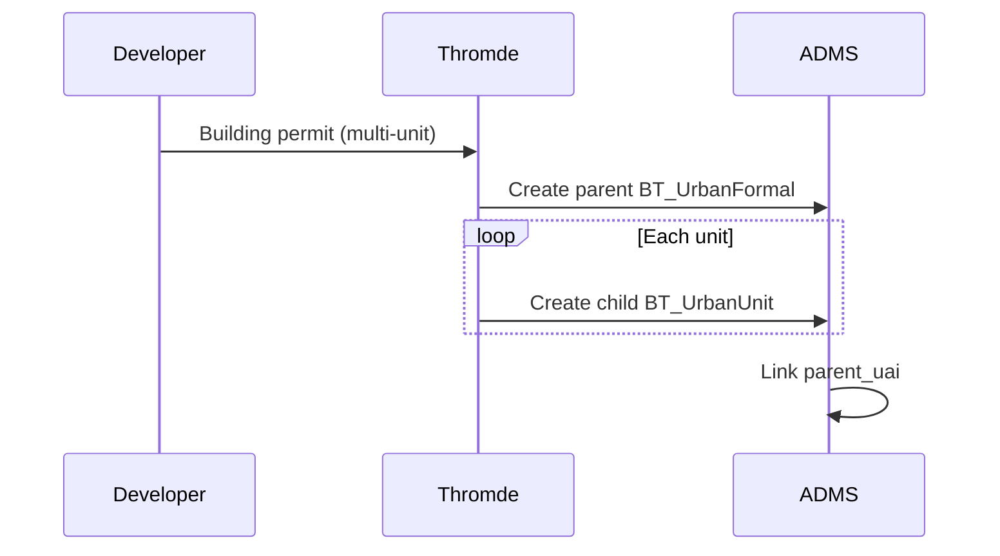

---

## Document control

| Version | Date | Author | Changes |
|---------|------|--------|---------|
| 1.0-draft | 2026-06 | BNAIF drafting team | Initial comprehensive framework — urban + rural |

**Distribution:** MoIT · DHS · All Thromdes · All Dzongkhags · NLCS · Bhutan Post · DDC · BSB · DDM · RBP

**Related documents:**
- `CITY ADDRESSING GUIDELINE PROPOSAL FOR BHUTAN.md` — Urban implementation detail (signage, typography)
- `Bhutan-Address-Reference-System-Proposal.md` — BUARS v0.1 (superseded by §6–§8 of this document)
- `Bhutan-Addressing-Guideline-ISO-19160-2-Gap-Analysis.md` — Conformance baseline

---

*End of document*
